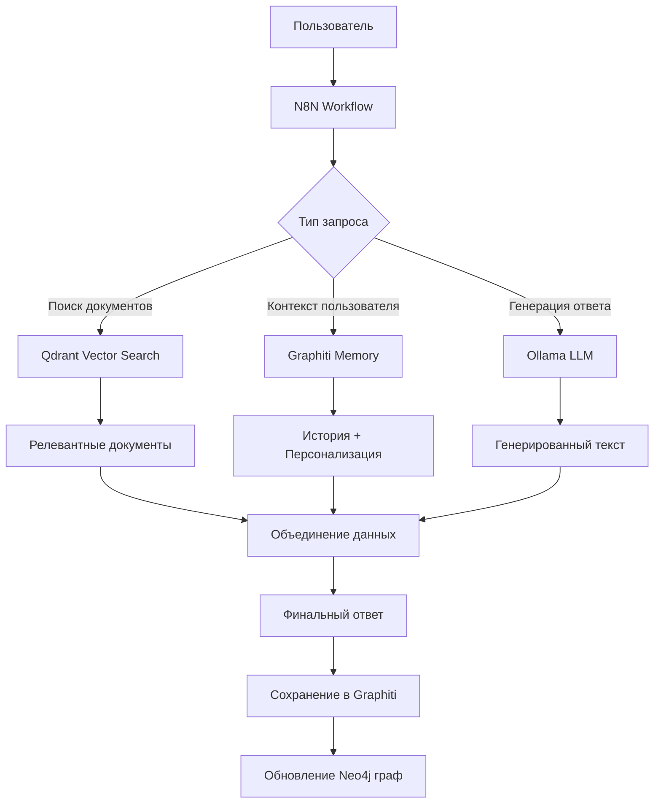
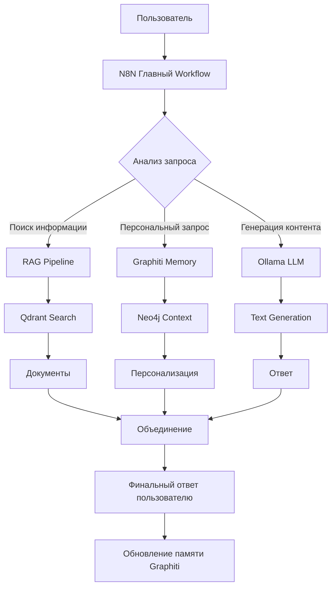

# N8N Self-hosted AI Starter Kit (N8N Стартовый набор для self-hosted ИИ)

**N8N Self-hosted AI Starter Kit** — это шаблон Docker Compose с открытым исходным кодом, предназначенный для быстрого развертывания комплексной локальной среды для разработки ИИ и low-code.

Созданный <https://github.com/n8n-io>, он объединяет self-hosted платформу n8n
с тщательно подобранным списком совместимых ИИ-продуктов и компонентов,
чтобы быстро начать создавать self-hosted ИИ-воркфлоу.

> [!TIP]
> [Прочитайте анонс](https://blog.n8n.io/self-hosted-ai/) (на английском)

## 🔄 Последние обновления

**Июнь 2025 (v1.2.0)**: Миграция с Zep на Graphiti.
- ✅ **МИГРАЦИЯ**: Полный переход с архивированного Zep Community Edition на Graphiti
- ✅ **НОВОЕ**: Graphiti - официальная замена для работы с векторными данными и памятью
- ✅ **УЛУЧШЕНО**: Стабильная работа всех контейнеров, нет падающих сервисов
- ✅ **ОБНОВЛЕНО**: Конфигурация для production с Neo4j + PostgreSQL pgvector
- ✅ **ГОТОВО**: Production-ready среда с современным FastAPI

**Июнь 2025 (v1.0.7)**: Критические исправления и улучшение стабильности.
- ✅ **ИСПРАВЛЕНО**: Критические ошибки health check для Qdrant и Graphiti
- ✅ **ИСПРАВЛЕНО**: YAML структуры Docker Compose файлов
- ✅ **ДОБАВЛЕНО**: Расширенная диагностика и устранение проблем
- ✅ **ДОБАВЛЕНО**: Автоматический скрипт исправления для Ubuntu (`scripts/fix-ubuntu.sh`)
- ✅ **ОБНОВЛЕНО**: Документация по обновлению на Ubuntu
- ✅ **ГОТОВО**: Production-окружение полностью готово к развёртыванию

**🚀 Быстрое обновление на Ubuntu:**
```bash
cd ~/N8N-AI-Starter-Kit
git pull origin main
chmod +x scripts/fix-ubuntu.sh
./scripts/fix-ubuntu.sh
```

**Май 2025 (v1.0.6)**: Улучшение GitHub-интеграции и документации.
- Улучшена структура документации проекта
- Добавлены шаблоны для GitHub Issues и Pull Requests
- Создан финальный чек-лист для публикации
- Удалены устаревшие ссылки в документации
- Обновлены инструкции по публикации на GitHub
- Оптимизирован скрипт `entrypoint.sh` для Ollama с индикатором прогресса загрузки моделей

[Подробнее о версии 1.0.4](./CHANGELOG.md) | [Руководство по документации](./docs/DOCUMENTATION_GUIDE.md) | [Распространенные проблемы](./docs/COMMON_ISSUES.md) | [Руководство по установке](./docs/SETUP_SCRIPT.md)

## 📋 Оглавление
- [Последние обновления](#-последние-обновления)
- [Введение](#-введение)
- [Компоненты](#-компоненты)
- [Варианты использования](#-варианты-использования)
- [Структура проекта](#-структура-проекта)
- [Системные требования](#-системные-требования)
- [Установка](#-установка)
  - [Быстрая установка](#️-быстрая-установка-рекомендуется)
  - [Профили запуска](#профили-запуска)
- [Быстрый старт](#️-быстрый-старт-и-использование)
- [Обслуживание системы](#-обслуживание-системы)
  - [Обновление](#-обновление)
  - [Резервное копирование](#-резервное-копирование)
- [Мониторинг производительности](#-мониторинг-производительности)
- [Обучающие материалы](#-обучающие-материалы-на-английском)
- [Видео-инструкции](#-видео-инструкция-на-английском)
- [Шаблоны и примеры](#️-шаблоны-и-примеры-на-английском)
- [Советы и хитрости](#советы-и-хитрости)
- [Устранение неполадок](#-устранение-неполадок)
- [Лицензия](#-лицензия)
- [Поддержка](#-поддержка)

> [📚 Руководство по документации](./docs/DOCUMENTATION_GUIDE.md) | [🔧 Руководство по установке](./docs/SETUP_SCRIPT.md) | [❗ Распространенные проблемы](./docs/COMMON_ISSUES.md) | [🚨 Устранение неполадок](TROUBLESHOOTING.md)

## 🔄 Быстрый переход к разделам

| Раздел | Описание |
|--------|----------|
| [📋 Оглавление](#-оглавление) | Полное содержание документа |
| [🔍 Введение](#-введение) | Общая информация о проекте |
| [🧩 Компоненты](#-компоненты) | Список и описание компонентов системы |
| [🚀 Варианты использования](#-варианты-использования) | Сценарии применения системы |
| [📁 Структура проекта](#-структура-проекта) | Организация файлов и директорий |
| [💻 Системные требования](#-системные-требования) | Минимальные требования для запуска |
| [🔄 Установка](#-установка) | Инструкции по установке |
| [⚡️ Быстрый старт](#️-быстрый-старт-и-использование) | Начало работы с системой |
| [🔧 Обслуживание системы](#-обслуживание-системы) | Обновление и резервное копирование |
| [📊 Мониторинг](#-система-мониторинга-и-аналитике-в-профиле-developer) | Система мониторинга и аналитики |
| [📚 Обучение](#-обучающие-материалы-на-английском) | Уроки и видео для обучения |
| [🛍️ Шаблоны](#️-шаблоны-и-примеры-на-английском) | Готовые примеры рабочих процессов |
| [💡 Советы](#советы-и-хитрости) | Полезные советы по использованию |
| [🔧 Устранение неполадок](#-устранение-неполадок) | Решение распространенных проблем |
| [📜 Лицензия](#-лицензия) | Информация о лицензии проекта |
| [💬 Поддержка](#-поддержка) | Получение помощи и поддержки |

<p align="center">
  
</p>

<p align="center">
  <a href="https://github.com/sattva2020/N8N-AI-Starter-Kit/stargazers">
    
  </a>
  <a href="https://github.com/sattva2020/N8N-AI-Starter-Kit/network/members">
    
  </a>
  <a href="https://github.com/sattva2020/N8N-AI-Starter-Kit/issues">
    
  </a>
  <a href="https://github.com/sattva2020/N8N-AI-Starter-Kit/blob/main/LICENSE">
    
  </a>
</p>

<p align="center">
  <a href="https://github.com/sattva2020/N8N-AI-Starter-Kit">
    
  </a>
  <a href="https://blog.n8n.io/self-hosted-ai/">
    
  </a>
</p>

## 🔍 Введение

**N8N Self-hosted AI Starter Kit** — это комплексное решение для создания современных AI-приложений полностью на собственной инфраструктуре, без зависимости от внешних облачных сервисов. В условиях повышенного внимания к конфиденциальности данных и растущей стоимости облачных AI-сервисов, этот набор инструментов позволяет разработчикам, бизнесу и энтузиастам реализовывать полноценные AI-решения, сохраняя контроль над своими данными.

### Философия проекта

Проект основан на четырех ключевых принципах:

1. **Полная автономность** — все компоненты работают локально, без необходимости отправлять данные во внешние сервисы.
2. **Доступность AI-технологий** — снижение барьера входа для работы с современными технологиями искусственного интеллекта.
3. **Модульность и гибкость** — возможность выбора только необходимых компонентов и легкого масштабирования системы.
4. **Открытость и сотрудничество** — использование open-source технологий и поддержка сообщества.

### Цели проекта

- **Демократизация AI-технологий** — предоставление инструментов для работы с AI широкому кругу пользователей, вне зависимости от бюджета и технических навыков.
- **Снижение зависимости от облачных провайдеров** — уменьшение рисков, связанных с изменением цен и условий облачных платформ.
- **Защита конфиденциальности данных** — обеспечение безопасности чувствительных данных при работе с AI-моделями.
- **Ускорение разработки AI-приложений** — предоставление готовой инфраструктуры для быстрого создания прототипов и рабочих решений.
- **Образовательная ценность** — возможность для разработчиков изучать и экспериментировать с различными компонентами AI-экосистемы.

### Преимущества использования

- **Полный контроль над данными** — все данные хранятся и обрабатываются только на вашем оборудовании.
- **Отсутствие затрат на API** — после первоначальной настройки нет необходимости в оплате запросов к внешним API.
- **Гибкая настройка** — возможность тонкой настройки каждого компонента системы под конкретные задачи.
- **Возможность работы офлайн** — система продолжит функционировать даже при отсутствии подключения к интернету (после первоначальной загрузки моделей).
- **Предсказуемая производительность** — отсутствие зависимости от загруженности внешних сервисов.

N8N AI Starter Kit создан для построения моста между сложными AI-технологиями и их практическим применением, делая advanced AI доступным для каждого — от индивидуальных разработчиков до крупных организаций, заботящихся о безопасности своих данных и контроле над инфраструктурой.

## 🧩 Компоненты

### Основные компоненты

#### Платформа управления рабочими процессами
✅ [**n8n**](https://n8n.io/) - Low-code платформа автоматизации с более чем 400 интеграциями и продвинутыми ИИ-компонентами для создания полноценных рабочих процессов.

#### Локальная обработка языковых моделей
✅ [**Ollama**](https://ollama.com/) - Кроссплатформенная LLM-платформа для запуска современных языковых моделей локально, без отправки данных на внешние серверы.

#### Векторное хранилище
✅ [**Qdrant**](https://qdrant.tech/) - Высокопроизводительное векторное хранилище с открытым исходным кодом для семантического поиска и RAG-приложений.

#### Базы данных и хранилища
✅ [**PostgreSQL**](https://www.postgresql.org/) - Надежная и производительная реляционная база данных, обеспечивающая надежное хранение данных.

✅ [**MinIO**](https://min.io/) - Высокопроизводительное S3-совместимое объектное хранилище для хранения бинарных данных, файлов, изображений и других ресурсов.

#### Инструменты администрирования и мониторинга
✅ [**pgAdmin**](https://www.pgadmin.org/) - Платформа для администрирования и разработки PostgreSQL с открытым исходным кодом. *(Профиль: developer)*

✅ [**Traefik**](https://traefik.io/traefik/) - Современный обратный прокси и балансировщик нагрузки, обеспечивающий маршрутизацию HTTP/HTTPS трафика, SSL-сертификаты и безопасность.

#### Расширенная функциональность AI
✅ [**Graphiti**](https://github.com/getzep/graphiti) - Современное решение для работы с векторными данными и памятью ИИ-приложений, обеспечивающее контекстно-зависимые взаимодействия через Neo4j граф базу данных.

✅ [**Neo4j**](https://neo4j.com/) - Ведущая графовая база данных для работы с связанными данными, используется Graphiti для хранения контекста и знаний.

✅ [**JupyterLab**](https://jupyter.org/) - Веб-интерактивная среда разработки для создания и анализа документов, содержащих живой код, формулы, визуализацию и текст. *(Профиль: developer)*

✅ [**Supabase**](https://supabase.com/) - Альтернатива Firebase с открытым исходным кодом, предоставляющая базу данных, аутентификацию и хранилище файлов.

### Расширенные компоненты (профиль developer)

#### Система мониторинга
- [**Prometheus**](https://prometheus.io/) - Система мониторинга и сбора метрик с открытым исходным кодом, разработанная для высокой надежности и масштабируемости.
- [**Grafana**](https://grafana.com/) - Платформа для визуализации и аналитики с открытым исходным кодом, позволяющая создавать интерактивные дашборды.
- [**cAdvisor**](https://github.com/google/cadvisor) - Анализатор использования ресурсов и производительности для контейнеров.
- [**Loki**](https://grafana.com/oss/loki/) - Горизонтально-масштабируемая система агрегации логов, разработанная Grafana Labs.

#### Инструменты аналитики данных
- [**Elasticsearch**](https://www.elastic.co/) - Распределенная поисковая система и аналитическая платформа для обработки больших объемов данных.
- [**Kibana**](https://www.elastic.co/kibana/) - Интерфейс визуализации и исследования данных для Elasticsearch.
- [**Jupyter Data Science Notebook**](https://jupyter.org/) - Расширенная версия Jupyter с предустановленными библиотеками для машинного обучения и анализа данных.

#### Мониторинг LLM/AI сервисов
- [**LangSmith**](https://www.langchain.com/langsmith) - Инструмент для мониторинга, отладки и оптимизации LangChain приложений.
- [**Weights & Biases**](https://wandb.ai/) - Платформа MLOps для отслеживания экспериментов, управления моделями и создания отчетов.

### Интеграция компонентов

Все компоненты N8N AI Starter Kit работают в единой Docker-сети, обеспечивая:

- **Безопасное взаимодействие** - компоненты общаются между собой по внутренней сети
- **Единое управление** - все сервисы запускаются и останавливаются вместе
- **Простоту настройки** - предварительно сконфигурированные взаимодействия между компонентами
- **Гибкость** - возможность включать только необходимые компоненты через систему профилей

> [!NOTE]
> При использовании профиля `cpu` запускаются основные компоненты, необходимые для работы n8n с локальным ИИ. Профиль `developer` включает дополнительные инструменты для разработки.

## 🏗️ Полная AI архитектура

### Диаграмма взаимодействия компонентов

```
┌──────────────────────────────────────────────────────────────┐
│                    ПОЛНАЯ AI АРХИТЕКТУРА                     │
├──────────────────────────────────────────────────────────────┤
│                                                              │
│  ┌─────────────┐    ┌─────────────┐    ┌─────────────┐       │
│  │     N8N     │    │   Qdrant    │    │  Graphiti   │       │
│  │ Workflows   │◄──►│Vector Search│◄──►│ Memory API  │       │
│  │ Automation  │    │   Engine    │    │ Context Mgmt│       │
│  └─────────────┘    └─────────────┘    └──────┬──────┘       │
│         │                   │                 │              │
│         ▼                   ▼                 ▼              │
│  ┌─────────────┐    ┌─────────────┐    ┌─────────────┐       │
│  │PostgreSQL   │    │   Ollama    │    │   Neo4j     │       │
│  │+ pgvector   │    │ Local LLMs  │    │ Graph DB    │       │
│  │Main Database│    │   Engine    │    │Knowledge Net │       │
│  └─────────────┘    └─────────────┘    └─────────────┘       │
│                                                              │
│              ┌─────────────────────────────┐                 │
│              │         Traefik             │                 │
│              │      Load Balancer          │                 │
│              │     & Reverse Proxy         │                 │
│              └─────────────────────────────┘                 │
└──────────────────────────────────────────────────────────────┘
```

### Роли компонентов в AI pipeline

| Компонент | Роль | Функции | API |
|-----------|------|---------|-----|
| **N8N** | Оркестратор | • Управление AI workflows<br/>• Интеграция сервисов<br/>• Автоматизация процессов | REST API |
| **Qdrant** | Векторный поиск | • Хранение embeddings<br/>• Similarity search<br/>• RAG документов | REST + gRPC |
| **Graphiti** | Память ИИ | • Контекст разговоров<br/>• Персонализация<br/>• Долговременная память | FastAPI |
| **Neo4j** | Граф знаний | • Связанные данные<br/>• Граф концепций<br/>• Рекомендации | Cypher + HTTP |
| **PostgreSQL** | Основная БД | • Структурированные данные<br/>• N8N конфигурация<br/>• Векторное хранение | SQL |
| **Ollama** | LLM движок | • Локальные модели<br/>• Генерация текста<br/>• Нет внешних API | REST API |

### AI Pipeline Flow



### Практические сценарии

#### 🔍 **RAG Pipeline (Retrieval-Augmented Generation)**
1. **Документы загружаются** → Векторизация → **Qdrant**
2. **Пользовательский запрос** → Vector search → **Qdrant**
3. **Найденные документы** + **Контекст из Graphiti** → **Ollama**
4. **Ответ** → Сохранение контекста → **Graphiti/Neo4j**

#### 🧠 **Персонализированный ИИ-ассистент**
1. **Пользователь** → История из **Graphiti** → Персонализация
2. **Запрос** → Контекстный поиск → **Qdrant** + **Neo4j**
3. **LLM генерация** → **Ollama** с полным контекстом
4. **Обновление графа** → **Neo4j** (новые связи/знания)

#### 📊 **Корпоративная система знаний**
1. **N8N** → Автоматическая обработка новых документов
2. **Qdrant** → Поиск по семантике
3. **Graphiti** → Отслеживание использования знаний
4. **Neo4j** → Карта взаимосвязей между темами

## 🚀 Варианты использования

### RAG-приложения и системы поиска по документам

- **Корпоративная база знаний** — создание системы для векторизации, хранения и интеллектуального поиска по внутренней документации компании с использованием Qdrant и Ollama.
- **Чат с документами** — разработка интерфейса для взаимодействия с PDF-файлами, отчетами и базами знаний с цитированием источников информации.
- **Правовой помощник** — система для анализа юридических документов, договоров и законодательных актов с локальной обработкой конфиденциальных данных.

### Персональные и корпоративные ассистенты

- **ИИ-ассистент для службы поддержки** — автоматизация обработки запросов клиентов с возможностью получения информации из внутренних баз знаний.
- **Персональный помощник для задач управления проектами** — интеграция с системами Jira, GitHub, Trello и другими инструментами для автоматизации рутинных задач.
- **Ассистент для работы с электронной почтой** — анализ, категоризация и автоматические ответы на входящие письма с использованием шаблонов.

### Обработка и анализ данных

- **Извлечение структурированной информации из документов** — автоматическое извлечение ключевых данных из счетов, договоров, отчетов и их сохранение в базе данных.
- **Аналитика настроений в отзывах клиентов** — анализ отзывов с сайта компании и социальных сетей для выявления проблемных зон в продукте или сервисе.
- **Автоматическое создание отчетов** — генерация структурированных отчетов на основе необработанных данных из различных источников.

### Вертикальные решения для отраслей

- **HR-ассистент** — автоматизация первичного скрининга резюме, составления ответов кандидатам и создания персонализированных задач для онбординга новых сотрудников.
- **Финансовый аналитик** — анализ финансовой документации, отчетов и новостей для выявления трендов и генерации инсайтов.
- **Медицинский помощник** — обработка и структурирование медицинских данных, генерация предварительных отчетов и анализ историй болезни.

### Образовательные инструменты

- **Персональный тьютор** — создание системы для адаптивного обучения, которая генерирует уникальные задания и объяснения на основе уровня знаний студента.
- **Инструмент для исследователей** — автоматизация анализа научной литературы, создание обзоров и выявление связей между исследованиями.
- **Генератор учебных материалов** — создание индивидуальных учебных материалов, тестов и упражнений на основе заданной темы и уровня сложности.

### Маркетинг и контент

- **Генератор контент-плана** — создание плана публикаций для социальных сетей с учетом аналитики и целевой аудитории.
- **Ассистент копирайтера** — помощь в написании и редактировании текстов с учетом SEO-требований и фирменного стиля.
- **Аналитик конкурентов** — мониторинг и анализ контента конкурентов для выявления трендов и генерации идей.

## 📁 Структура проекта

<pre>
N8N-AI-Starter-Kit/
├── 🐳 docker-compose.yml     # Основной файл конфигурации Docker Compose
├── 🔐 .env                   # Файл с переменными окружения (создается из template.env)
├── 📚 README.md              # Документация проекта
├── 🔧 TROUBLESHOOTING.md     # Руководство по устранению неполадок
├── 💾 backups/               # Директория для хранения резервных копий
│   └── 📦 n8n_db_*.sql       # Файлы резервных копий базы данных n8n
├── 🧩 compose/               # Дополнительные файлы Docker Compose для разных сервисов
│   ├── 🌐 networks.yml        # Конфигурация сетей Docker
│   ├── 🧰 optional-services.yml  # Конфигурация дополнительных сервисов
│   ├── 🔥 supabase-compose.yml   # Конфигурация Supabase
│   └── 🧠 zep-compose.yaml       # Конфигурация Zep (системы долговременной памяти)
├── ⚙️ config/                # Файлы конфигурации для различных сервисов
│   ├── 🔄 middlewares.yml    # Конфигурация промежуточного ПО Traefik
│   ├── 🤖 ollama-models.txt  # Список моделей для предварительной загрузки в Ollama
│   └── 🧠 zep.yaml           # Конфигурация сервиса Zep
├── 📋 docs/                  # Расширенная документация проекта
│   ├── 🔍 ENHANCED_FEATURES.md     # Описание расширенных возможностей
│   ├── 📝 IMPROVEMENTS_SUMMARY.md  # Сводка улучшений проекта
│   ├── 📝 IMPROVEMENTS_SUMMARY_RU.md  # Сводка улучшений на русском языке
│   ├── 🧪 SETUP_SCRIPT_TESTING.md      # Тестирование скрипта настройки
│   ├── 📋 SETUP_SCRIPT.md          # Руководство по скрипту настройки
│   ├── 📝 PRE_PUBLISH_CHECKLIST.md # Чек-лист перед публикацией на GitHub
│   ├── 📋 DOCUMENTATION_GUIDE.md   # Руководство по документации
│   ├── 📋 COMMON_ISSUES.md         # Распространенные проблемы
│   ├── 📋 AUTOMATION_SCRIPTS.md    # Автоматизационные скрипты
│   └── 📋 FINAL_REPORT.md          # Итоговый отчет
├── 📋 logs/                  # Директория для хранения логов
│   ├── ❌ backup_error.log   # Логи ошибок процесса резервного копирования
│   └── ✅ backup.log         # Основные логи процесса резервного копирования
├── 🔄 n8n/                   # Директория с данными n8n
│   └── 🎮 demo-data/         # Демонстрационные данные для n8n
│       ├── 🔑 credentials/   # Предустановленные учетные данные для демо
│       └── 🌊 workflows/     # Предустановленные рабочие процессы (workflows)
└── 📜 scripts/               # Вспомогательные скрипты для управления системой
    ├── 💾 backup.sh          # Скрипт для создания резервных копий
    ├── 🔧 fix-env-vars.sh    # Скрипт для исправления проблем с переменными окружения (Linux/macOS)
    ├── 🔧 fix-env-vars.ps1   # Скрипт для исправления проблем с переменными окружения (Windows)
    ├── 🚀 fix-and-start.sh   # Скрипт для исправления переменных и запуска проекта (Linux/macOS)
    ├── 🚀 fix-and-start.ps1  # Скрипт для исправления переменных и запуска проекта (Windows)
    ├── 🔄 start-with-limited-parallelism.sh # Скрипт для запуска с ограниченным параллелизмом (Linux/macOS)
    └── 🔄 start-with-limited-parallelism.ps1 # Скрипт для запуска с ограниченным параллелизмом (Windows)
    ├── 🧹 clean-docker.sh    # Скрипт для очистки Docker ресурсов
    ├── 🚀 setup.sh           # Скрипт для первоначальной настройки системы
    ├── 📝 template.env       # Шаблон файла переменных окружения
    └── 🔄 update.sh          # Скрипт для обновления компонентов системы
</pre>

### Описание ключевых компонентов

#### Основные файлы
- **docker-compose.yml** — главный конфигурационный файл, определяющий все сервисы, сети и тома для развертывания системы с помощью Docker Compose.
- **.env** — содержит переменные окружения для конфигурации всех сервисов (пароли, API-ключи, настройки и т.д.).
- **README.md** — основная документация проекта с инструкциями по установке, настройке и использованию.
- **TROUBLESHOOTING.md** — руководство по устранению распространенных проблем при установке и использовании.

#### Директория compose/
Содержит дополнительные файлы Docker Compose для модульной организации сервисов:
- **networks.yml** — определение всех сетей Docker, используемых в проекте.
- **optional-services.yml** — конфигурация для опциональных сервисов, которые можно включить при необходимости.
- **supabase-compose.yml** — конфигурация для развертывания Supabase (альтернатика Firebase с открытым исходным кодом).
- **zep-compose.yaml** — конфигурация для Zep, системы долговременной памяти для ИИ-приложений.

#### Директория config/
Содержит файлы конфигурации для различных компонентов системы:
- **middlewares.yml** — настройка промежуточного ПО для Traefik (обратный прокси).
- **ollama-models.txt** — список моделей для предварительной загрузки в Ollama при запуске.
- **zep.yaml** — конфигурация сервиса Zep для управления контекстом и памятью в ИИ-приложениях.

#### Директория docs/
Содержит расширенную документацию и руководства по различным аспектам проекта:
- **CHANGELOG.md** — подробное описание всех обновлений проекта.
- **COMMON_ISSUES.md** — руководство по решению наиболее частых проблем, включая проблемы с паролями Traefik, конфликтами сетей Docker и переменными окружения.
- **SETUP_SCRIPT.md** — документация по улучшениям скрипта установки.

#### Директория scripts/
Содержит полезные скрипты для управления системой:
- **setup.sh** — автоматизирует процесс первоначальной настройки, создавая необходимые директории и файл .env.
- **backup.sh** — создает резервные копии баз данных и других критически важных данных.
- **update.sh** — обновляет все компоненты системы до последних версий.
- **clean-docker.sh** — очищает неиспользуемые Docker ресурсы для освобождения места.
- **template.env** — шаблон для создания файла .env с необходимыми переменными окружения.

#### Директория n8n/demo-data/
Содержит предустановленные демонстрационные данные для быстрого начала работы с n8n:
- **credentials/** — предустановленные учетные данные для интеграций.
- **workflows/** — готовые рабочие процессы, демонстрирующие различные возможности системы (интеграции с Telegram, AI агенты, обработка контента и т.д.).

#### Директория backups/
Предназначена для хранения резервных копий данных системы:
- **n8n_db_*.sql** — файлы резервных копий базы данных n8n, созданные скриптом backup.sh.

#### Директория logs/
Содержит файлы логов для мониторинга состояния системы:
- **backup.log** — журнал выполнения скрипта резервного копирования.
- **backup_error.log** — журнал ошибок, возникающих при резервном копировании.

## 🔄 Установка

> [!NOTE]
> **Все сервисы используют только образы с тегом `latest`.** Это позволяет избежать ошибок с отсутствием манифестов и упростить поддержку. Если потребуется стабильность, зафиксируйте нужные теги вручную в docker-compose файлах.

### 📥 Клонирование репозитория

Для начала работы с N8N AI Starter Kit рекомендуется использовать стабильные версии (теги) вместо ветки `main`, которая может содержать экспериментальные изменения.

## Доступные версии

| Тег    | Описание                                         | Дата выпуска |
|--------|--------------------------------------------------|--------------|
| v1.0.8 | Автоматическое создание .env из template.env     | 22.06.2025   |
| v1.0.7 | Интеллектуальный запуск и улучшенная диагностика | 22.06.2025   |
| v1.0.6 | Улучшение GitHub-интеграции и документации       | 23.05.2025   |
| v1.0.5 | Подготовка релиза v1.0.5: обновление документации и исправления | 22.05.2025   |
| v1.0.4 | Интеграция Ollama entrypoint и Open WebUI, улучшения документации и шаблонов        | 23.05.2025   |
| v1.0.3 | Улучшенная конфигурация Vector и Supabase        | 22.05.2025   |
| v1.0.2 | Оптимизация производительности и стабильности    | 21.05.2025   |
| v1.0.1 | Оптимизация производительности и стабильности    | 21.05.2025   |
| v1.0.0 | Первый официальный релиз                         | 20.05.2025   |

## Способы клонирования

### Рекомендуемый способ: Клонирование определенной версии

```bash
# Клонирование репозитория с конкретной версией (рекомендуется)
git clone --branch v1.0.8 https://github.com/sattva2020/N8N-AI-Starter-Kit.git

# Переход в директорию проекта
cd N8N-AI-Starter-Kit
```

### Альтернативный способ: Клонирование с последующим выбором версии

```bash
# Клонирование всего репозитория
git clone https://github.com/sattva2020/N8N-AI-Starter-Kit.git

# Переход в директорию проекта
cd N8N-AI-Starter-Kit

# Просмотр доступных версий
git tag -l

# Переключение на нужную версию
git checkout v1.0.6
```

> [!NOTE]
> При использовании тега вы будете находиться в состоянии "detached HEAD". Если планируете вносить изменения, создайте новую ветку:
> ```powershell
> git switch -c моя-новая-ветка
> ```

После клонирования репозитория перейдите к [инструкциям по установке](#-установка).

### ⚡️ Быстрая установка (рекомендуется)

Самый простой способ установить и настроить N8N AI Starter Kit — использовать автоматический скрипт установки с конкретной стабильной версией. Этот метод автоматизирует весь процесс настройки, включая создание `.env` файла со случайными безопасными паролями.

> [!TIP]
> **📖 Подробная инструкция для Ubuntu**: См. [docs/UBUNTU_DEPLOYMENT.md](./docs/UBUNTU_DEPLOYMENT.md) для полного руководства по развертыванию на Ubuntu сервере.

#### Для Linux:

```bash
# Клонирование репозитория с конкретной стабильной версией (рекомендуется)
git clone --branch v1.0.8 https://github.com/sattva2020/N8N-AI-Starter-Kit.git
cd N8N-AI-Starter-Kit

# Установка прав на выполнение для скриптов
chmod +x scripts/*.sh
chmod +x *.sh

# 🚀 НОВИНКА: Интеллектуальный запуск с автоматическим созданием .env
./start.sh

# Альтернативно: Классическая установка через setup.sh
./scripts/setup.sh
```

#### 🐧 Специально для Ubuntu VM (новое):

```bash
# Шаг 1: Проверка текущего пользователя и прав
./scripts/check-user-setup.sh

# Шаг 2: Если вы запущены от root - создайте обычного пользователя
sudo bash scripts/create-user.sh

# Шаг 3: Переключитесь на созданного пользователя
su - n8nuser

# Шаг 4: Клонируйте проект под обычным пользователем
git clone --branch v1.0.8 https://github.com/sattva2020/N8N-AI-Starter-Kit.git
cd N8N-AI-Starter-Kit

# Шаг 5: Запустите полное развертывание для Ubuntu
./scripts/ubuntu-vm-deploy.sh
```

> **⚠️ Важно для Ubuntu VM**: 
> - 🚫 **НЕ запускайте** скрипты развертывания от root пользователя
> - ✅ **Используйте** обычного пользователя с sudo правами  
> - 🔧 **Новые скрипты** автоматически создают пользователя и настраивают права
> - 📖 **Подробная инструкция**: [docs/UBUNTU_VM_COMPLETE_GUIDE.md](./docs/UBUNTU_VM_COMPLETE_GUIDE.md)

> **✨ Что нового в v1.0.8**: 
> - 🔐 **Автоматическое создание `.env`** из `template.env` с безопасными паролями
> - 🚀 **Одна команда для запуска**: `./start.sh` теперь делает всё автоматически  
> - ✅ **Решена проблема Ubuntu**: больше не нужно вручную создавать `.env` файл
> - 📋 **Интеллектуальная настройка**: автоопределение профилей и исправление проблем

#### Для Windows (PowerShell):

```powershell
# Клонирование репозитория
git clone https://github.com/sattva2020/N8N-AI-Starter-Kit.git
cd N8N-AI-Starter-Kit

# Запуск скрипта автоматической установки через WSL или Docker Desktop
# Вариант 1: Если установлен WSL2
wsl ./scripts/setup.sh

# Вариант 2: Через Docker напрямую (требует Docker Desktop)
docker run --rm -v ${PWD}:/app -w /app bash ./scripts/setup.sh
```

#### После успешного выполнения скрипта установки вы можете запустить проект с нужным профилем:

```bash
# Универсальный скрипт запуска (Linux/macOS)
# Выберите один из доступных профилей: cpu, gpu-nvidia, gpu-amd, developer
./scripts/start.sh cpu
```

```powershell
# Универсальный скрипт запуска (Windows)
# Выберите один из доступных профилей: cpu, gpu-nvidia, gpu-amd, developer
.\scripts\start.ps1 cpu
```

```bash
# Альтернативный метод запуска через Docker Compose
# Для стандартной конфигурации на CPU (по умолчанию)
docker compose --profile cpu up -d

# Для конфигурации с NVIDIA GPU
docker compose --profile gpu-nvidia up -d

# Для конфигурации с AMD GPU
docker compose --profile gpu-amd up -d

# Для расширенной конфигурации разработчика (с JupyterLab, pgAdmin и др.)
docker compose --profile developer up -d
```

### Запуск с использованием автоматического исправления проблем

Если вы столкнулись с проблемами при запуске (конфликт сетей, отсутствующие переменные окружения), используйте специальные скрипты:

#### Для Linux/macOS:

```bash
# Только исправление переменных окружения
./scripts/fix-env-vars.sh

# Полное исправление и запуск
./scripts/fix-and-start.sh

# Запуск с ограниченным параллелизмом (предотвращает ошибки с API-лимитами)
./scripts/start-with-limited-parallelism.sh

# Запуск с указанием максимального числа параллельных выполнений
./scripts/start-with-limited-parallelism.sh -p 3
```

#### Для Windows (PowerShell):

```powershell
# Только исправление переменных окружения
.\scripts\fix-env-vars.ps1

# Полное исправление и запуск
.\scripts\fix-and-start.ps1

# Запуск с ограниченным параллелизмом (предотвращает ошибки с API-лимитами)
.\scripts\start-with-limited-parallelism.ps1

# Запуск с указанием максимального числа параллельных выполнений
.\scripts\start-with-limited-parallelism.ps1 -MaxParallelism 3
```

> [!TIP]
> Подробное описание автоматизационных скриптов доступно в [документации по скриптам автоматизации](./docs/AUTOMATION_SCRIPTS.md).

#### Для Windows (PowerShell):

```powershell
# Только исправление переменных окружения
.\scripts\fix-env-vars.ps1

# Полное исправление и запуск
.\scripts\fix-and-start.ps1
```

> [!TIP]
> Если вы получаете предупреждения о переменных `ANON_KEY` и `SERVICE_ROLE_KEY`, это означает,
> что Docker Compose не может найти эти переменные. Используйте скрипты выше для автоматического
> исправления проблемы или обратитесь к [документации по переменным окружения](./docs/COMMON_ISSUES.md#проблемы-с-переменными-окружения).

### Запуск с использованием Docker Compose

> [!NOTE]
> **С мая 2025 года все сервисы запускаются с образом `latest`.** Если возникнут проблемы с совместимостью, рекомендуется зафиксировать стабильные теги для критичных сервисов.

#### Для пользователей с GPU Nvidia

```bash
docker compose --profile gpu-nvidia up -d --build
```

> [!NOTE]
> Если вы ранее не использовали ваш GPU Nvidia с Docker, пожалуйста, следуйте
> [инструкциям Ollama для Docker](https://github.com/ollama/ollama/blob/main/docs/docker.md).

#### Для пользователей с GPU AMD (Linux)

```bash
docker compose --profile gpu-amd up -d --build
```

#### Для пользователей Mac / Apple Silicon

Если вы используете Mac с процессором M1 или новее, вы, к сожалению, не можете предоставить Docker-инстансу доступ к вашему GPU. В этом случае есть два варианта:

1.  Запустить стартовый набор полностью на CPU, как описано в разделе "Для всех остальных" ниже.
2.  Запустить Ollama на вашем Mac для более быстрого вывода (inference) и подключиться к нему из инстанса n8n.

Если вы хотите запустить Ollama на вашем Mac, ознакомьтесь с
[инструкциями по установке на домашней странице Ollama](https://ollama.com/)
и запустите стартовый набор следующим образом:

```bash
docker compose up -d --build
```

#### Для всех остальных (CPU)

```bash
docker compose --profile cpu up -d --build
```

### Запуск базовой конфигурации
Если вам нужны только основные сервисы:
```bash
docker compose --profile cpu up -d
```
### Запуск с инструментами для разработчика (расширенная конфигурация)
Для запуска с полным набором инструментов, включая JupyterLab и pgAdmin:
```bash
docker compose --profile developer up -d
```


## ⚡️ Быстрый старт и использование

Ядром N8N AI Starter Kit является файл Docker Compose, предварительно настроенный с сетевыми параметрами и хранилищами, что минимизирует необходимость в дополнительных установках.
После выполнения шагов по установке, просто следуйте приведенным ниже шагам, чтобы начать.

1.  Откройте `http://localhost:5678/` (или `https://n8n.ваш-домен.com/`, если настроен Traefik с вашим доменом) в вашем браузере, чтобы настроить n8n. Это нужно будет сделать только один раз.
2.  Откройте включенный воркфлоу:
    `http://localhost:5678/workflow/srOnR8PAY3u4RSwb` (или `https://n8n.ваш-домен.com/workflow/srOnR8PAY3u4RSwb`)
3.  Нажмите кнопку **Chat** в нижней части холста, чтобы запустить воркфлоу.
4.  Если вы запускаете воркфлоу впервые, возможно, потребуется подождать,
    пока Ollama завершит загрузку Llama3.2. Вы можете проверить логи Docker
    консоли, чтобы отследить прогресс.


Чтобы открыть n8n в любое время, посетите `http://localhost:5678/` (или ваш настроенный домен) в вашем браузере.

С вашим инстансом n8n у вас будет доступ к более чем 400 интеграциям и
набору базовых и продвинутых ИИ-узлов, таких как
[AI Agent](https://docs.n8n.io/integrations/builtin/cluster-nodes/root-nodes/n8n-nodes-langchain.agent/),
[Text classifier](https://docs.n8n.io/integrations/builtin/cluster-nodes/root-nodes/n8n-nodes-langchain.text-classifier/)
и [Information Extractor](https://docs.n8n.io/integrations/builtin/cluster-nodes/root-nodes/n8n-nodes-langchain.information-extractor/).
Чтобы все оставалось локальным, просто не забывайте использовать узел Ollama для вашей
языковой модели и Qdrant в качестве вашего векторного хранилища. Zep будет использоваться для долговременной памяти в воркфлоу.

> [!NOTE]
> Этот стартовый набор предназначен для того, чтобы помочь вам начать работу с self-hosted ИИ-воркфлоу.
> Хотя он не полностью оптимизирован для производственных сред, он
> объединяет надежные компоненты, которые хорошо работают вместе для проектов
> проверки концепции (proof-of-concept). Вы можете настроить его под свои конкретные нужды.

## 🔧 Обслуживание системы

### 🔄 Обновление

> [!TIP]
> Для обновления всех сервисов до последних версий используйте команду:
> ```powershell
> docker compose pull && docker compose up -d
> ```
> Это скачает самые свежие образы с тегом `latest` для всех сервисов.

* ### Для обновления системы вы можете использовать встроенный скрипт:
```powershell
./scripts/update.sh [профиль]
```
Где [профиль] может быть: cpu (по умолчанию), gpu-nvidia, gpu-amd или developer.

* ### Или использовать ручное обновление через Docker Compose:

*   ### Для конфигураций с GPU Nvidia:

```powershell
docker compose --profile gpu-nvidia pull
docker compose --profile gpu-nvidia up -d --force-recreate
```

*   ### Для пользователей Mac / Apple Silicon (использующих конфигурацию без профиля GPU):

```powershell
docker compose pull
docker compose up -d --force-recreate
```

*   ### Для конфигураций без GPU (CPU):

```powershell
docker compose --profile cpu pull
docker compose --profile cpu up -d --force-recreate
```

### 💾 Резервное копирование

Для создания резервной копии базы данных n8n и других важных данных:

```powershell
# Windows с WSL
wsl ./scripts/backup.sh

# Windows с Docker
docker run --rm -v ${PWD}:/app -w /app bash ./scripts/backup.sh
```

Резервные копии будут сохранены в директории `backups/` с указанием даты и времени создания.
## 📊 Система мониторинга и аналитики в профиле developer

Профиль "developer" включает в себя полноценную систему мониторинга, аналитики данных и мониторинга LLM/AI сервисов на основе современного стека инструментов:

### 1. Мониторинг системы

* **Prometheus** (`https://prometheus.ваш-домен.com` или `http://localhost:9090`) — система мониторинга и сбора метрик для отслеживания производительности всех сервисов
* **Grafana** (`https://grafana.ваш-домен.com` или `http://localhost:3000`) — платформа для визуализации данных мониторинга с предустановленными дашбордами для Docker, n8n и Ollama
* **cAdvisor** (`https://cadvisor.ваш-домен.com` или `http://localhost:8080`) — мониторинг использования ресурсов контейнерами
* **Loki** (`https://loki.ваш-домен.com`) — система сбора и анализа логов, интегрированная с Grafana

#### Доступ к Grafana:

Используйте логин `admin` и пароль из переменной `GRAFANA_ADMIN_PASSWORD` в файле `.env` (установлен скриптом `setup.sh`).

#### Предустановленные дашборды:

* Docker Container & Host Metrics
* n8n Performance Dashboard
* Ollama Resource Usage
* Container Logs (через Loki)

#### Использование Prometheus для мониторинга API

Для мониторинга ваших API и сервисов вы можете добавить конфигурацию сбора метрик в файл `config/prometheus/prometheus.yml`. Пример добавления нового целевого сервиса:

```yaml
scrape_configs:
  - job_name: 'my-custom-service'
    scrape_interval: 15s
    static_configs:
      - targets: ['my-service:8000']
```


## 📈 Мониторинг производительности

Для эффективной работы N8N AI Starter Kit важно регулярно контролировать производительность системы, особенно при интенсивном использовании.

### Базовый мониторинг (для всех профилей)

В любом профиле вы можете использовать стандартные средства Docker для базового мониторинга:

```powershell
# Проверка использования ресурсов контейнерами
docker stats

# Просмотр логов конкретного контейнера
docker logs n8n-ai-starter-kit-ollama-1 --tail 100

# Проверка состояния всех контейнеров
docker ps -a
```

### Расширенный мониторинг в профиле developer

Профиль `developer` включает полноценное решение для мониторинга на базе Prometheus, Grafana, cAdvisor и Loki:

1. **Доступ к дашбордам Grafana**
   - Откройте `http://localhost:3000` (логин/пароль указаны в `.env`)
   - Используйте готовые дашборды для мониторинга:
     - System Overview - общий обзор системы
     - Docker Containers - производительность контейнеров
     - n8n Workflows - метрики выполнения рабочих процессов

2. **Просмотр логов в Grafana/Loki**
   - В Grafana перейдите в раздел "Explore"
   - Выберите источник данных "Loki"
   - Используйте LogQL для фильтрации логов:
     ```
     {container_name="n8n-ai-starter-kit-ollama-1"} |= "error"
     ```

### Оптимизация производительности

Рекомендации для улучшения производительности:

#### Для контейнера Ollama:
```yaml
# В docker-compose.yml
ollama:
  deploy:
    resources:
      limits:
        memory: 8G  # Ограничение памяти
      reservations:
        memory: 4G  # Гарантированная память
```

#### Для профиля с GPU:
```powershell
# Проверка использования GPU
nvidia-smi

# Мониторинг GPU в реальном времени
nvidia-smi --query-gpu=utilization.gpu,memory.used,memory.total --format=csv -l 5
```

> [!TIP]
> При интенсивной нагрузке на контейнер Ollama рекомендуется увеличить лимиты памяти и CPU, особенно при использовании больших языковых моделей.

## 👥 Вклад в проект

Мы рады любому вкладу в развитие N8N AI Starter Kit! Вот как вы можете помочь:

### Как внести свой вклад

1. **Форкните репозиторий** - Создайте собственную копию проекта на GitHub
2. **Создайте ветку для функции** - `git checkout -b feature/amazing-feature`
3. **Внесите изменения** - Реализуйте новую функцию или исправление
4. **Закоммитьте изменения** - `git commit -m 'Add amazing feature'`
5. **Отправьте изменения** - `git push origin feature/amazing-feature`
6. **Создайте Pull Request** - Отправьте запрос на добавление ваших изменений в основной проект

### Что можно улучшить

- **Добавление новых демо-воркфлоу** - Создание примеров для конкретных отраслей и задач
- **Оптимизация конфигураций** - Настройка контейнеров для лучшей производительности
- **Улучшение документации** - Дополнение и перевод инструкций
- **Разработка дополнительных скриптов** - Автоматизация часто используемых задач
- **Тестирование на различных платформах** - Проверка совместимости и создание инструкций

### Шаблон для сообщения о проблеме

При создании issue на GitHub, пожалуйста, используйте следующий шаблон:

```markdown
## Описание проблемы
Четкое и краткое описание проблемы.

## Шаги для воспроизведения
1. Запустите '...'
2. Нажмите на '....'
3. Прокрутите до '....'
4. Наблюдается ошибка

## Ожидаемое поведение
Четкое и краткое описание того, что должно происходить.

## Скриншоты
Если применимо, добавьте скриншоты для иллюстрации проблемы.

## Окружение
 - ОС: [например, Windows 10]
 - Версия Docker: [например, 24.0.5]
 - Профиль запуска: [например, cpu, gpu-nvidia]
 - Используемые модели: [например, Llama3]

## Дополнительный контекст
Любая другая информация о проблеме.
```


## 👓 Обучающие материалы (на английском)

n8n полон полезного контента для быстрого старта с его ИИ-концепциями
и узлами. Если у вас возникла проблема, перейдите в раздел [Поддержка](#поддержка).

- [AI agents for developers: from theory to practice with n8n](https://blog.n8n.io/ai-agents/)
- [Tutorial: Build an AI workflow in n8n](https://docs.n8n.io/advanced-ai/intro-tutorial/)
- [Langchain Concepts in n8n](https://docs.n8n.io/advanced-ai/langchain/langchain-n8n/)
- [Demonstration of key differences between agents and chains](https://docs.n8n.io/advanced-ai/examples/agent-chain-comparison/)
- [What are vector databases?](https://docs.n8n.io/advanced-ai/examples/understand-vector-databases/)

## 🎥 Видео-инструкция (на английском)

- [Installing and using Local AI for n8n](https://www.youtube.com/watch?v=xz_X2N-hPg0)

## 🛍️ Шаблоны и примеры (на английском)

Для получения дополнительных идей ИИ-воркфлоу посетите [**официальную галерею ИИ-шаблонов n8n**](https://n8n.io/workflows/?categories=AI).
Из каждого воркфлоу выберите кнопку **Use workflow**, чтобы автоматически импортировать воркфлоу в ваш локальный инстанс n8n.

### Изучите ключевые концепции ИИ

- [AI Agent Chat](https://n8n.io/workflows/1954-ai-agent-chat/)
- [AI chat with any data source (using the n8n workflow too)](https://n8n.io/workflows/2026-ai-chat-with-any-data-source-using-the-n8n-workflow-tool/)
- [Chat with OpenAI Assistant (by adding a memory)](https://n8n.io/workflows/2098-chat-with-openai-assistant-by-adding-a-memory/)
- [Use an open-source LLM (via Hugging Face)](https://n8n.io/workflows/1980-use-an-open-source-llm-via-huggingface/)
- [Chat with PDF docs using AI (quoting sources)](https://n8n.io/workflows/2165-chat-with-pdf-docs-using-ai-quoting-sources/)
- [AI agent that can scrape webpages](https://n8n.io/workflows/2006-ai-agent-that-can-scrape-webpages/)

### Шаблоны для локального ИИ

- [Tax Code Assistant](https://n8n.io/workflows/2341-build-a-tax-code-assistant-with-qdrant-mistralai-and-openai/)
- [Breakdown Documents into Study Notes with MistralAI and Qdrant](https://n8n.io/workflows/2339-breakdown-documents-into-study-notes-using-templating-mistralai-and-qdrant/)
- [Financial Documents Assistant using Qdrant and](https://n8n.io/workflows/2335-build-a-financial-documents-assistant-using-qdrant-and-mistralai/) [Mistral.ai](http://mistral.ai/)
- [Recipe Recommendations with Qdrant and Mistral](https://n8n.io/workflows/2333-recipe-recommendations-with-qdrant-and-mistral/)

## Советы и хитрости

### Доступ к локальным файлам

Self-hosted AI starter kit создаст общую папку (по умолчанию,
расположенную в том же каталоге), которая монтируется в контейнер n8n и
позволяет n8n получать доступ к файлам на диске. Эта папка внутри контейнера n8n
находится по адресу `/data/shared` -- это путь, который вам нужно будет использовать в узлах,
взаимодействующих с локальной файловой системой.

**Узлы, взаимодействующие с локальной файловой системой**

- [Read/Write Files from Disk](https://docs.n8n.io/integrations/builtin/core-nodes/n8n-nodes-base.filesreadwrite/)
- [Local File Trigger](https://docs.n8n.io/integrations/builtin/core-nodes/n8n-nodes-base.localfiletrigger/)
- [Execute Command](https://docs.n8n.io/integrations/builtin/core-nodes/n8n-nodes-base.executecommand/)

## 💻 Системные требования

Перед установкой N8N AI Starter Kit убедитесь, что ваша система соответствует следующим минимальным требованиям:

### Минимальные требования
- **Процессор:** 4 ядра CPU
- **Оперативная память:** 8 GB RAM
- **Место на диске:** 20 GB свободного места (больше при использовании большого количества моделей Ollama)
- **Операционная система:** 
  - Linux (Ubuntu 20.04+, Debian 11+)
  - Windows 10/11 с WSL2 или Docker Desktop
  - macOS 11+ с Docker Desktop

### Рекомендуемые требования
- **Процессор:** 8+ ядер CPU
- **Оперативная память:** 16+ GB RAM
- **Место на диске:** 50+ GB SSD
- **GPU:** NVIDIA с поддержкой CUDA (8+ GB VRAM) для полноценной работы с языковыми моделями
- **Сеть:** Стабильное интернет-соединение для первоначальной загрузки моделей

### Требования для профиля Developer
При использовании полного профиля `developer` с инструментами мониторинга и аналитики:
- **Оперативная память:** 24+ GB RAM
- **Место на диске:** 100+ GB SSD

### Требования для запуска с GPU
- **NVIDIA GPU:** Драйвер NVIDIA версии 525+ и CUDA 12.0+
- **AMD GPU:** Linux с поддержкой ROCm (только для определенных моделей карт)

> [!TIP]
> Для оптимальной производительности рекомендуется использовать SSD вместо HDD, особенно для хранения данных баз данных и векторных хранилищ.

## 🔧 Устранение неполадок

N8N AI Starter Kit включает подробное руководство по устранению распространенных проблем, с которыми вы можете столкнуться при работе с системой.

### Частые проблемы

#### 1. Конфликт сетей Docker
Если вы сталкиваетесь с ошибками типа "networks.backend conflicts with imported resource", используйте специальные скрипты для решения проблемы:
```powershell
# Linux/macOS
./scripts/fix-and-start.sh

# Windows PowerShell
.\scripts\fix-and-start.ps1
```

#### 2. Проблемы с переменными окружения
Если Docker Compose выдает предупреждения о неопределенных переменных, используйте:
```powershell
# Linux/macOS
./scripts/fix-env-vars.sh

# Windows PowerShell
.\scripts\fix-env-vars.ps1
```

#### 3. Ошибка "concurrent map writes"
Для решения этой распространенной проблемы Docker Compose запустите систему с ограниченным параллелизмом:
```powershell
# Linux/macOS
COMPOSE_PARALLEL_LIMIT=1 docker compose --profile cpu up -d

# Windows PowerShell
$env:COMPOSE_PARALLEL_LIMIT=1; docker compose --profile cpu up -d
```

#### 4. Модели Ollama долго загружаются или не загружаются
Проверьте логи контейнера Ollama и убедитесь в наличии достаточного места на диске и памяти:
```powershell
docker logs n8n-ai-starter-kit-ollama-1
```

### Подробное руководство по устранению неполадок

Для получения более подробных инструкций по решению всех распространенных проблем, обратитесь к полному руководству:

[🔧 Подробное руководство по устранению неполадок](./TROUBLESHOOTING.md)

## 📜 Лицензия

Этот проект лицензирован под лицензией Apache License 2.0 - см. файл
[LICENSE](LICENSE) для получения подробной информации.

## 💬 Поддержка

Присоединяйтесь к обсуждению на [форуме n8n](https://community.n8n.io/), где вы
можете:

- **Делиться своей работой**: Покажите, что вы создали с помощью n8n, и вдохновите других
  в сообществе.
- **Задавать вопросы**: Независимо от того, начинаете ли вы или являетесь опытным
  профессионалом, сообщество и наша команда готовы помочь с любыми проблемами.
- **Предлагать идеи**: Есть идея для функции или улучшения? Дайте нам знать!
  Мы всегда рады услышать, что бы вы хотели видеть дальше.

### Настройка Учетных Данных для Других Сервисов

Для взаимодействия с некоторыми встроенными сервисами из ваших воркфлоу n8n, вам может потребоваться настроить соответствующие учетные данные в n8n. Перейдите в ваш n8n (`http://localhost:5678/credentials` или `https://n8n.ваш-домен.com/credentials`) и создайте новые учетные данные, используя указанные ниже параметры.

#### MinIO (S3-совместимое хранилище)

Если ваши воркфлоу n8n должны взаимодействовать с MinIO для чтения или записи файлов:

1.  **Тип учетных данных в n8n:** `AWS S3`
2.  **Параметры подключения:**
    *   **Access Key ID:** Используйте значение переменной `MINIO_ROOT_USER` из вашего файла `.env`.
    *   **Secret Access Key:** Используйте значение переменной `MINIO_ROOT_PASSWORD` из вашего файла `.env`.
    *   **Endpoint:** `http://minio:9000`
    *   **Use Path Style:** `true` (обычно рекомендуется для MinIO)
    *   **Region:** Можно указать любое значение, например, `us-east-1` (MinIO не строго привязан к регионам AWS).
    *   **Bucket Name:** Укажите имя бакета, с которым вы хотите работать (его нужно предварительно создать в MinIO через консоль `https://minio-console.ваш-домен.com` или `http://localhost:9001`, если доступно напрямую).

#### Qdrant (Векторное хранилище)

Для подключения к Qdrant из n8n (например, при использовании узлов Langchain для работы с векторными базами данных):

1.  **Тип учетных данных в n8n:** `Qdrant`
2.  **Параметры подключения:**
    *   **URL:** `http://qdrant:6333` (это адрес для REST API Qdrant внутри Docker-сети)
    *   **API Key:** (Опционально) Если вы настроили API-ключ для Qdrant, укажите его здесь. По умолчанию API-ключ может не требоваться.

#### PostgreSQL (для доступа из воркфлоу)

Если вы хотите взаимодействовать с базой данных PostgreSQL (той, что используется n8n, или другой, созданной на этом же инстансе) из ваших воркфлоу:

1.  **Тип учетных данных в n8n:** `Postgres`
2.  **Параметры подключения:**
    *   **Host:** `postgres` (имя сервиса PostgreSQL в Docker-сети)
    *   **Port:** `5432`
    *   **Database:** Используйте значение переменной `POSTGRES_DB` из вашего файла `.env` (это база данных n8n по умолчанию) или имя другой базы данных, к которой вы хотите подключиться.
    *   **User:** Используйте значение переменной `POSTGRES_USER` из вашего файла `.env` или другого пользователя БД.
    *   **Password:** Используйте значение переменной `POSTGRES_PASSWORD` из вашего файла `.env` или пароль другого пользователя БД.
    *   **SSL Mode:** `disable` (для внутреннего подключения в Docker-сети без SSL).

#### Zep (Долговременная память для ИИ)

Для интеграции Zep в ваши ИИ-воркфлоу для управления памятью:

1.  **Тип учетных данных в n8n:** `Zep` (или `HTTP Request` / `Generic API Credential`, если специального узла Zep нет, а используется его API)
2.  **Параметры подключения:**
    *   **Base URL:** `http://zep:8000` (предполагается, что сервис Zep называется `zep` и слушает порт `8000` внутри Docker-сети. Проверьте актуальное имя сервиса и порт в вашем `docker-compose.yml` для Zep).
    *   **API Key:** (Опционально) Если Zep требует API-ключ, укажите его.

#### Supabase (Альтернатива Firebase с открытым исходным кодом)

Для взаимодействия с вашим экземпляром Supabase из n8n (например, для работы с базой данных, аутентификацией, хранилищем):

1.  **Тип учетных данных в n8n:** `Supabase`
2.  **Параметры подключения:**
    *   **Project URL:** `http://supabase-kong:8000` (внутренний адрес API-шлюза Supabase (Kong) в Docker-сети).
    *   **Anon Key:** Используйте значение переменной `SUPABASE_ANON_KEY` из вашего файла `.env`.
    *   **Service Role Key:** Используйте значение переменной `SUPABASE_SERVICE_ROLE_KEY` из вашего файла `.env`.

    **Примечание:** Внешний доступ к API Supabase настроен через Traefik по адресу, указанному в переменной `SUPABASE_API_DOMAIN` вашего `.env` файла (например, `https://api.supabase.sattva-ai.top`). Для подключения из n8n к API Supabase используется внутренний адрес `http://supabase-kong:8000`. Доступ к Supabase Studio (веб-интерфейсу) осуществляется по адресу, указанному в переменной `SUPABASE_STUDIO_DOMAIN` (например, `https://supabase.sattva-ai.top`).

Эти инструкции помогут пользователям правильно настроить n8n для работы со всеми основными компонентами вашего стартового набора. Убедитесь, что имена сервисов (`minio`, `qdrant`, `postgres`, `zep`, `supabase`) и порты соответствуют тем, что указаны в вашем актуальном файле `docker-compose.yml`.


## Клонирование репозитория с определенным тегом

При установке N8N AI Starter Kit рекомендуется использовать стабильные теги (например, v1.0.5 или v1.0.6) вместо ветки `main`, которая может содержать экспериментальные изменения.

### Способ 1: Клонирование репозитория с определенным тегом сразу

Этот метод позволяет сразу получить конкретную версию репозитория:

```bash
# Клонирование репозитория с конкретным тегом
git clone --branch v1.0.6 https://github.com/sattva2020/N8N-AI-Starter-Kit.git

# Переход в директорию проекта
cd N8N-AI-Starter-Kit
```

> [!TIP]
> Во время установки вам будет предложена опция предварительной загрузки языковых моделей для Ollama.
> Это позволит избежать задержек при первом использовании системы. Выберите эту опцию, если у вас есть 
> стабильное интернет-соединение и вы готовы подождать загрузку моделей во время установки.

Вы также можете загрузить модели в любое время с помощью команды:
```bash
./scripts/preload-models.sh
```

[⬆️ Вернуться к содержанию](#-содержание)

## 📊 Мониторинг системы

### Встроенный мониторинг

Используйте встроенные скрипты для мониторинга состояния системы:

```bash
# Постоянный мониторинг (обновление каждые 5 секунд)
./scripts/monitor.sh

# Разовая проверка статуса
./scripts/monitor.sh once

# Просмотр логов конкретного контейнера
./scripts/monitor.sh logs n8n

# Диагностика проблем
./scripts/diagnose.sh
```

### Доступ к панелям мониторинга

- **Traefik Dashboard**: `http://localhost:8080` - состояние прокси и маршрутизации
- **Qdrant Dashboard**: `http://localhost:6333/dashboard` - состояние векторной БД  
- **Docker Stats**: `docker stats` - использование ресурсов контейнерами

### Ключевые метрики для мониторинга

- **Использование памяти**: критично для работы LLM моделей
- **Место на диске**: модели Ollama могут занимать много места
- **Сетевая активность**: проверка доступности сервисов
- **Логи ошибок**: раннее обнаружение проблем

---

## 🐧 Развертывание на Ubuntu

### ⚡ Автоматическая установка (рекомендуется)
```bash
# Автоматическая установка одной командой
curl -fsSL https://raw.githubusercontent.com/sattva2020/N8N-AI-Starter-Kit/main/scripts/ubuntu-install.sh | bash
```

🎯 **Что включает**: Docker, зависимости, клонирование проекта, интерактивная настройка

📖 **Инструкция**: [docs/UBUNTU_INSTALL_SCRIPT.md](./docs/UBUNTU_INSTALL_SCRIPT.md)

### Ручное развертывание
```bash
# 1. Установка Docker
curl -fsSL https://get.docker.com -o get-docker.sh
sudo sh get-docker.sh
sudo usermod -aG docker $USER

# 2. Клонирование проекта
git clone https://github.com/sattva2020/N8N-AI-Starter-Kit.git
cd N8N-AI-Starter-Kit

# 3. Запуск автоматической настройки
chmod +x scripts/*.sh start.sh
./start.sh
```

### Полная инструкция
📖 **Подробное руководство**: [docs/UBUNTU_DEPLOYMENT.md](./docs/UBUNTU_DEPLOYMENT.md)

Включает:
- ✅ Системные требования и подготовка
- ✅ Пошаговая установка Docker и зависимостей  
- ✅ Настройка доменов и SSL сертификатов
- ✅ Решение типичных проблем Ubuntu
- ✅ Мониторинг и обслуживание

## 🔍 Проверка контейнеров

После запуска N8N AI Starter Kit важно убедиться, что все контейнеры работают корректно и без ошибок.

### Комплексная проверка всех контейнеров

Используйте специальный скрипт для полной диагностики:

```bash
# Запуск комплексной проверки
chmod +x scripts/comprehensive-container-check.sh
./scripts/comprehensive-container-check.sh
```

**Что проверяет скрипт:**
- ✅ Статус каждого контейнера (running/stopped)
- 🏥 Health checks всех сервисов
- 📋 Анализ логов на наличие ошибок
- 🌐 Доступность портов (5678, 11434, 6333, и др.)
- 📊 Общая статистика Docker

### Быстрая проверка основных сервисов

Для быстрой проверки статуса используйте:

```bash
# Быстрая проверка
chmod +x scripts/quick-check.sh
./scripts/quick-check.sh

# Или проверка вручную
curl http://localhost:5678   # N8N веб-интерфейс
curl http://localhost:11434  # Ollama API  
curl http://localhost:6333   # Qdrant векторная БД
```

### Анализ ошибок в логах

Для детального анализа ошибок в логах конкретного контейнера:

```bash
# Анализ ошибок в логах
chmod +x scripts/analyze-logs.sh
./scripts/analyze-logs.sh [имя_контейнера] [количество_строк]

# Примеры использования
./scripts/analyze-logs.sh n8n-ai-starter-kit-n8n-1 100
./scripts/analyze-logs.sh n8n-ai-starter-kit-ollama-1 50
```

### Диагностика конкретных сервисов

#### N8N + PostgreSQL
```bash
# Проверка связки N8N + PostgreSQL
./scripts/diagnose-n8n-postgres.sh

# Мониторинг N8N в реальном времени
./scripts/monitor-n8n.sh

# Сброс при проблемах
./scripts/reset-n8n-postgres.sh
```

#### Проверка Docker системы
```bash
# Общая информация о Docker
docker system info
docker system df

# Статус всех контейнеров проекта
docker-compose ps

# Просмотр ресурсов
docker stats --no-stream
```

### Типичные проблемы и решения

**❌ Контейнер не запускается:**
```bash
# 1. Проверить логи
docker logs [имя_контейнера] --tail 50

# 2. Перезапустить сервис
docker-compose restart [имя_сервиса]

# 3. Полный перезапуск
docker-compose down && docker-compose up -d
```

**❌ Health check failed:**
```bash
# Проверить состояние health check
docker inspect [имя_контейнера] | grep -A 10 Health

# Выполнить health check вручную
docker exec [имя_контейнера] [команда_healthcheck]
```

**❌ Порт недоступен:**
```bash
# Проверить проброс портов
docker port [имя_контейнера]

# Проверить сетевые настройки
docker network inspect [имя_сети]
```

> [!TIP]
> Полное руководство по диагностике контейнеров доступно в [docs/CONTAINER_VALIDATION_GUIDE.md](docs/CONTAINER_VALIDATION_GUIDE.md)

> [!NOTE]
> Ожидаемый результат успешной проверки: все контейнеры в статусе "running", health checks проходят, порты доступны, в логах нет критических ошибок.

## 🚀 Следующие шаги для разработки

После успешного запуска всех компонентов полной AI архитектуры, вы можете приступить к созданию продвинутых AI-приложений:

### 1. 🔧 Создать N8N workflow для тестирования всех компонентов

**Цель:** Убедиться, что все сервисы взаимодействуют корректно

**Шаги:**
```bash
# 1. Откройте N8N
http://localhost:5678

# 2. Создайте новый workflow с узлами:
# - HTTP Request → Qdrant (тест векторного поиска)
# - HTTP Request → Graphiti (тест API памяти)
# - HTTP Request → Neo4j (тест графовой БД)
# - HTTP Request → Ollama (тест локальной LLM)
```
**Пример тестового workflow:**
- **Узел 1:** Qdrant - создание коллекции и вставка тестового вектора
- **Узел 2:** Graphiti - создание пользователя и сохранение контекста
- **Узел 3:** Neo4j - создание узла и связи
- **Узел 4:** Ollama - генерация тестового ответа

### 2. 📚 Настроить RAG pipeline: Документы → Qdrant → LLM

**Цель:** Создать систему поиска по документам с генерацией ответов

**Архитектура RAG:**
```
PDF/Документы → Эмбеддинги → Qdrant → Поиск → Ollama → Ответ
```

**Реализация в N8N:**
```bash
# Workflow компоненты:
1. File Trigger - загрузка PDF/документов
2. Text Splitter - разбивка на чанки  
3. Embedding Generator - создание векторов
4. Qdrant Insert - сохранение в векторную БД
5. User Query Handler - обработка запросов
6. Qdrant Search - поиск релевантных документов
7. Ollama LLM - генерация ответа на основе найденных документов
```

**Практические шаги:**
1. Создайте коллекцию в Qdrant для документов
2. Настройте workflow для автоматической обработки новых файлов
3. Интегрируйте поиск с LLM для генерации ответов
4. Добавьте цитирование источников

### 3. 🧠 Интегрировать память: Graphiti для персонализации

**Цель:** Добавить долговременную память и персонализацию

**Возможности Graphiti + Neo4j:**
- История разговоров пользователей
- Персональные предпочтения
- Контекстные рекомендации
- Граф знаний организации

**Интеграция в N8N:**
```bash
# Memory Workflow:
1. User Identification - определение пользователя
2. Context Retrieval - получение истории из Graphiti
3. Preference Analysis - анализ предпочтений в Neo4j
4. Personalized Response - персонализированный ответ
5. Memory Update - обновление контекста
```

**Практическая реализация:**
- Создание профилей пользователей в Neo4j
- Сохранение истории взаимодействий в Graphiti  
- Анализ предпочтений для рекомендаций
- Контекстно-зависимые ответы ИИ

### 4. 🤖 Добавить Ollama для локальных LLM моделей

**Цель:** Интегрировать мощные локальные языковые модели

**Проверка Ollama:**
```bash
# Убедитесь что Ollama запущен
curl http://localhost:11434/api/tags

# Если Ollama не запущен:
docker compose up -d ollama
```

**Популярные модели для установки:**
```bash
# Через N8N workflow или напрямую:
docker exec ollama ollama pull llama3.2    # Быстрая модель
docker exec ollama ollama pull mistral     # Качественная модель  
docker exec ollama ollama pull codellama   # Для программирования
docker exec ollama ollama pull nomic-embed-text  # Для эмбеддингов
```

**Интеграция в N8N workflows:**
- **Текстовая генерация:** Ответы на вопросы, написание статей
- **Анализ данных:** Извлечение информации из текстов
- **Кодирование:** Генерация и объяснение кода
- **Эмбеддинги:** Создание векторов для Qdrant

### 5. 🔗 Создать комплексный AI Assistant

**Объединение всех компонентов в единую систему:**



### 6. 📊 Мониторинг и аналитика

**Добавление отслеживания эффективности AI системы:**

- **Метрики качества:** Точность ответов, релевантность поиска
- **Производительность:** Время ответа, использование ресурсов  
- **Использование:** Популярные запросы, активность пользователей
- **Ошибки:** Мониторинг сбоев и некорректных ответов

### 🎯 Практические проекты для начала

#### Уровень 1: Базовые интеграции
- [ ] Простой чат-бот с Ollama
- [ ] Поиск по корпоративным документам
- [ ] Сохранение истории в Graphiti

#### Уровень 2: RAG системы
- [ ] Поиск по корпоративным документам
- [ ] QA система с цитированием
- [ ] Персонализированные рекомендации

#### Уровень 3: Продвинутые AI приложения
- [ ] Мультимодальный ассистент (текст + изображения)
- [ ] Система аналитики данных с ИИ
- [ ] Автоматизированный workflow с множественными агентами

### 📚 Полезные ресурсы

- **[N8N Documentation](https://docs.n8n.io/)** - Официальная документация
- **[Qdrant Documentation](https://qdrant.tech/documentation/)** - Векторная база данных
- **[Graphiti GitHub](https://github.com/getzep/graphiti)** - Memory API
- **[Neo4j Cypher Manual](https://neo4j.com/docs/cypher-manual/)** - Язык запросов графов
- **[Ollama Model Library](https://ollama.com/library)** - Доступные LLM модели

> [!TIP]
> Начните с простых workflows и постепенно добавляйте сложность. Каждый компонент можно тестировать независимо, а затем объединять в комплексные решения.

> [!NOTE]
> Все примеры кода и готовые workflows будут добавлены в папку `examples/` по мере развития проекта.