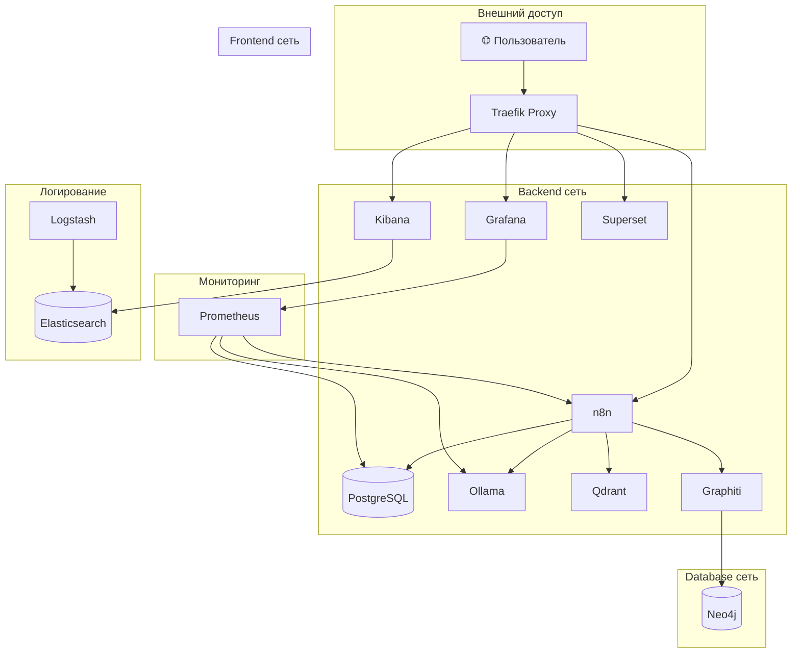

# N8N AI Starter Kit

[](https://github.co## 📚 Документация

| Раздел | Описание |
|--------|----------|
| [🚀 Начало работы](./docs/01-getting-started.md) | Пошаговая установка и первый запуск |
| [⚙️ Конфигурация](./docs/02-configuration.md) | Подробные настройки всех компонентов |
| [🏗️ Архитектура](./docs/03-architecture.md) | Техническое описание системы |
| [🤖 AI-функции](./docs/04-guides/ai-features.md) | Полное руководство по AI-сервисам |
| [📊 Мониторинг и логирование](./docs/05-monitoring-and-logging.md) | Настройка систем наблюдения |
| [🔧 Автоматизация развертывания](./docs/06-automation-scripts.md) | Скрипты и автоматизация процессов |
| [📋 Рабочие процессы](./docs/07-workflows-integration.md) | Создание и интеграция workflows |
| [🛠 Устранение неполадок](./TROUBLESHOOTING.md) | Решение проблем и отладка |

### 🎯 Рекомендуемый порядок изучения

**Для новичков:**
1. **[Начало работы](./docs/01-getting-started.md)** - Установка и запуск
2. **[Конфигурация](./docs/02-configuration.md)** - Базовые настройки
3. **[AI-функции](./docs/04-guides/ai-features.md)** - Изучение возможностей AI

**Для разработчиков:**
1. **[Архитектура](./docs/03-architecture.md)** - Понимание системы
2. **[Рабочие процессы](./docs/07-workflows-integration.md)** - Создание автоматизации
3. **[Автоматизация развертывания](./docs/06-automation-scripts.md)** - Оптимизация процессов

**Для DevOps-инженеров:**
1. **[Мониторинг и логирование](./docs/05-monitoring-and-logging.md)** - Наблюдение системы
2. **[Автоматизация развертывания](./docs/06-automation-scripts.md)** - Масштабирование
3. **[Архитектура](./docs/03-architecture.md)** - Оптимизация инфраструктуры0/N8N-AI-Starter-Kit/actions/workflows/pre-commit.yml)

**Мощная платформа для AI-автоматизации с локальными LLM**

> **🆕 Важное исправление**: Переменные LightRAG (`LIGHTRAG_API_KEY`, `TOKEN_SECRET`, `LIGHRAG_DOMAIN`) теперь генерируются автоматически во всех режимах установки скрипта `setup.sh`. Это устраняет предупреждения Docker Compose о недостающих переменных окружения.

N8N AI Starter Kit — это готовое к развертыванию решение для создания интеллектуальных рабочих процессов. Объединяет n8n с передовыми инструментами для локального запуска больших языковых моделей, векторного поиска и комплексного мониторинга.

## ✨ Возможности

### 🤖 AI & Автоматизация
- **n8n** — платформа визуального программирования рабочих процессов
- **Ollama** — локальный запуск больших языковых моделей (LLM)
- **Qdrant** — векторная база данных для семантического поиска
- **Graphiti + Neo4j** — работа с графовыми данными и памятью AI-агентов

### 📊 Мониторинг & Аналитика
- **Prometheus + Grafana** — сбор метрик и визуализация
- **Elasticsearch + Kibana** — централизованное логирование
- **Superset** — бизнес-аналитика и визуализация данных

### 🛠 Инфраструктура
- **Traefik** — обратный прокси с автоматическими SSL-сертификатами (ACME HTTP-01, HTTP→HTTPS редирект)
- **PostgreSQL** — основная база данных
- **Docker Compose** — оркестрация микросервисов
- **Гибкие профили** — запуск только нужных компонентов

## 🚀 Быстрый старт (3 минуты)

### 1. Подготовка
```bash
# Клонируем репозиторий
git clone https://github.com/sattva2020/N8N-AI-Starter-Kit.git
cd N8N-AI-Starter-Kit

# Создаем конфигурацию
cp env.schema .env
```

### 2. Настройка
Откройте `.env` и заполните **обязательные** поля:
```bash
# Обязательно измените эти значения:
DOMAIN_NAME=your-domain.com
N8N_ENCRYPTION_KEY=your_32_char_encryption_key_here_
POSTGRES_PASSWORD=your_secure_password_here
ACME_EMAIL=your-email@example.com
```

### 3. Запуск
```bash
# Интеллектуальный запуск (автоопределение профиля)
./start.sh

# Или ручной запуск базовых сервисов
docker-compose --profile default up -d
```

### 4. Доступ
После запуска откройте:
- **n8n**: `https://n8n.your-domain.com`
- **Grafana**: `https://grafana.your-domain.com`
- **Traefik Dashboard**: `http://localhost:8080`

## 🏗️ Архитектура


```mermaid
graph TD
    subgraph "Внешний доступ"
        U[🌐 Пользователь] --> T[Traefik Proxy]
    end

    subgraph "Frontend сеть"
        T
    end

    subgraph "Backend сеть"
        T --> N[n8n]
        T --> G[Grafana]
        T --> K[Kibana]
        T --> S[Superset]

        N --> DB[(PostgreSQL)]
        N --> O[Ollama]
        N --> Q[Qdrant]
        N --> GR[Graphiti]
    end

    subgraph "Database сеть"
        GR --> Neo[(Neo4j)]
        DB
    end

    subgraph "Мониторинг"
        P[Prometheus] --> N
        P --> O
        P --> DB
        G --> P
    end

    subgraph "Логирование"
        L[Logstash] --> E[(Elasticsearch)]
        K --> E
    end
```

## 📋 Профили запуска

Выберите нужные компоненты через переменную `COMPOSE_PROFILES`:

| Профиль | Сервисы | Назначение |
|---------|---------|------------|
| `default` | n8n, postgres, traefik, ollama, qdrant | Базовый AI-стек |
| `developer` | pgadmin, jupyterlab | Инструменты разработки |
| `monitoring` | prometheus, grafana, alertmanager | Мониторинг и алерты |
| `logging` | elasticsearch, kibana, logstash | Централизованное логирование |
| `analytics` | superset, clickhouse, redis | Бизнес-аналитика |

```bash
# Пример: запуск с мониторингом
COMPOSE_PROFILES=default,monitoring ./start.sh
```

## 🔧 Конфигурация

### Переменные окружения
Все настройки в файле `.env`. Основные разделы:

- **Базовые**: `DOMAIN_NAME`, `COMPOSE_PROJECT_NAME`
- **PostgreSQL**: `POSTGRES_PASSWORD`, `POSTGRES_USER`
- **N8N**: `N8N_ENCRYPTION_KEY`, `N8N_HOST`, `N8N_ADMIN_TOKEN`, `N8N_PUBLIC_API_DISABLED`
- **AI-сервисы**: `OLLAMA_DOMAIN`, `QDRANT_URL`
- **Мониторинг**: `GRAFANA_ADMIN_PASSWORD`, `PROMETHEUS_RETENTION`

### Автоматизация настройки
```bash
# Интерактивная настройка
./scripts/setup.sh

# Генерация .env из шаблона
./scripts/setup.sh --generate-only
```

### Импорт credential в n8n (авто)
- Поддерживаются два типа аутентификации:
    - Bearer-токен администратора (Personal Access Token) для REST: передайте `--token` или переменную `N8N_ADMIN_TOKEN`.
    - Публичный API-ключ для Public API: передайте `--api-key` или `N8N_API_KEY` (требуется `N8N_PUBLIC_API_DISABLED=false`).
- Для массового импорта используйте файл `config/samples/credentials-bulk.json`.
- Если в JSON встречаются плейсхолдеры вида `${VAR}` или `${VAR:-default}`, добавьте флаг `--expand-env` и (опционально) `--env-file .env` — значения будут подставлены из окружения.
 - Требуется `python3` для работы `--expand-env` и разбора CSV в bulk-режиме (при отсутствии — используйте JSON).
 - Обработка `--expand-env` устойчива: при пустом/некорректном JSON подстановка пропускается (no-op), чтобы избежать падений.
 - На Windows CRLF могут ломать JSON: скрипт автоматически удаляет `\r` перед валидацией, чтобы исключить ошибки парсинга.

Приведение типов и схем (авто):
- Алиасы типов автоматически маппятся на нативные типы n8n: `qdrant` → `qdrantApi`, `bolt` → `neo4j`, `grafana` → `grafanaApi`.
- Postgres: порт приводится к числу, если `ssl` не задан — добавляется `ssl:false` для соответствия схеме.
 - Postgres: порт приводится к числу; `ssl` ожидается как одно из `disable|allow|require` — по умолчанию выставляется `ssl: "disable"`, булевы значения приводятся к строковым (`true`→`require`, `false`→`disable`).
- Redis: поле `url` вида `redis://host:6379` разбирается на `host` и `port` (как ожидает схема n8n).
- Neo4j: порт приводится к числу.

Примеры:

```bash
# DRY-RUN массового импорта через Public API-ключ (ничего не создаёт)
./scripts/create_n8n_credential.sh \
    --dry-run \
    --api-key "$N8N_API_KEY" \
    --bulk-file config/samples/credentials-bulk.json \
    --n8n-url https://n8n.your-domain.com

# Реальный импорт с подстановкой значений из .env
./scripts/create_n8n_credential.sh \
    --api-key "$N8N_API_KEY" \
    --bulk-file config/samples/credentials-bulk.json \
    --env-file .env \
    --expand-env \
    --n8n-url https://n8n.your-domain.com

# Создание одной учётки Postgres через админский PAT
./scripts/create_n8n_credential.sh \
    --token "$N8N_ADMIN_TOKEN" \
    --name "Postgres DB" \
    --type postgres \
    --data '{"host":"postgres","port":5432,"database":"n8n","user":"n8n","password":"'$POSTGRES_PASSWORD'"}' \
    --n8n-url https://n8n.your-domain.com
```

Примечание: если при импорте увидите ошибку JSONDecodeError в python (во время `--expand-env`), убедитесь, что блок `data` в JSON не пустой/`null`. В актуальной версии скрипта добавлена защита: пустые значения пропускаются при подстановке.
Ещё: если появится `jq: invalid JSON text passed to --argjson`, значит `data` невалидный JSON — скрипт теперь валидирует и:
- в bulk-режиме: пропустит такую запись с сообщением;
- в одиночном режиме: завершится с ошибкой и покажет проблемное содержимое.

## � Документация

| Раздел | Описание |
|--------|----------|
| [🚀 Начало работы](./docs/01-getting-started.md) | Пошаговая установка и первый запуск |
| [⚙️ Конфигурация](./docs/02-configuration.md) | Подробные настройки всех компонентов |
| [🏗️ Архитектура](./docs/03-architecture.md) | Техническое описание системы |
| [🤖 AI-функции](./docs/04-guides/ai-features.md) | Работа с Ollama, Qdrant, Graphiti |
| [📊 Мониторинг](./docs/04-guides/monitoring-and-logging.md) | Настройка Grafana, Kibana |
| [🔧 Скрипты](./docs/04-guides/automation-scripts.md) | Автоматизация и управление |
| [🛠 Устранение неполадок](./TROUBLESHOOTING.md) | Решение проблем |

## 🎯 Примеры использования

### RAG-система с Ollama
1. Создайте workflow в n8n
2. Добавьте узел Ollama для генерации эмбеддингов
3. Используйте Qdrant для семантического поиска
4. Комбинируйте результаты для ответа

### Автоматизация с AI
1. Настройте webhook в n8n
2. Добавьте обработку текста через Ollama
3. Сохраняйте результаты в PostgreSQL
4. Отправляйте уведомления

## 🛠 Разработка и вклад

### Требования для разработки
- Docker & Docker Compose
- Git
- Node.js (для некоторых скриптов)
- Python 3.8+ (для тестов)

### Работа с кодом
```bash
# Установка pre-commit хуков
pip install pre-commit
pre-commit install

# Запуск тестов
pytest

# Линтинг
pre-commit run --all-files
```

### Структура проекта
```
├── compose/           # Docker Compose файлы для разных стеков
├── config/            # Конфигурация сервисов (Grafana, Prometheus, etc.)
├── data/              # Постоянные данные (не коммитить)
├── docs/              # Документация
├── scripts/           # Скрипты автоматизации
├── n8n/               # Рабочие процессы и данные n8n
├── tests/             # Тесты и валидация
└── .github/           # CI/CD и GitHub настройки
```

## � Лицензия

Этот проект распространяется под лицензией MIT. Подробности в файле [LICENSE](./LICENSE).

## 🤝 Сообщество

- **GitHub Issues**: [Сообщить о проблеме](https://github.com/sattva2020/N8N-AI-Starter-Kit/issues)
- **Discussions**: [Обсудить проект](https://github.com/sattva2020/N8N-AI-Starter-Kit/discussions)
- **Telegram**: [Сообщество n8n RU](https://t.me/n8n_ru)

---

**Готовы начать?** Следуйте [быстрому старту](#-быстрый-старт-3-минуты) или изучите [подробную документацию](./docs/)!