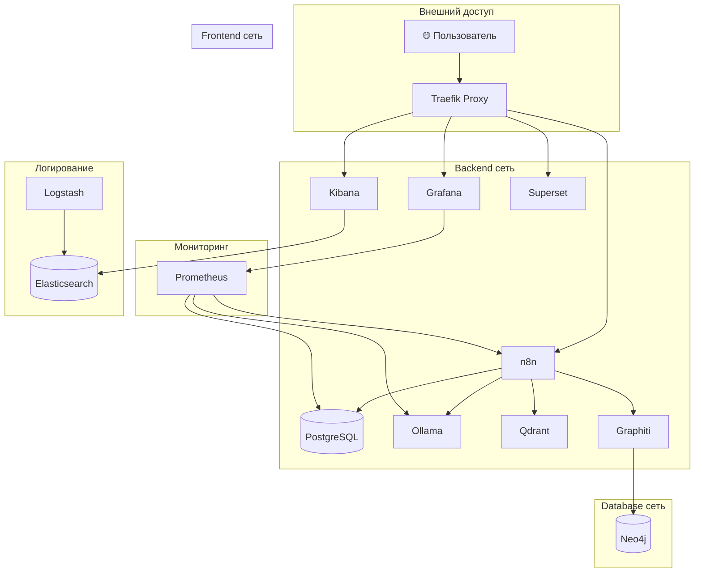

# N8N AI Starter Kit

## Update 2025-09-03: Traefik — единый пароль и упрощённая настройка

- В `scripts/setup.sh` убран двойной запрос пароля для Traefik. Теперь один пароль используется и для Dashboard, и для admin basic-auth.
- Хэш admin basic-auth генерируется автоматически: при наличии `htpasswd` — bcrypt; иначе fallback через `openssl -apr1`; в крайнем случае — безопасный дефолт с предупреждением. Конфиг `middlewares.yml` обновляется автоматически.

- Update 2025-09-03 (patch): `scripts/setup.sh` now suppresses printing plaintext secrets during `--generate-only`, saves the generated `.env` with restrictive permissions (600), and will auto-create the `traefik_letsencrypt` Docker volume during non-interactive generation to avoid manual volume recreation after cleanups.

## Update 2025-09-02: Windows bootstrap and YAML validator

The repository now includes a hardened Windows bootstrap and automatic YAML validation/formatting:

- Windows setup: run `scripts/bootstrap-windows.ps1` (supports non-interactive `-Yes` mode). It detects Python via `py -3`/`python` and installs required tools (pip upgrades, PyYAML, ShellCheck) using available package managers.
- YAML validation/formatting: `scripts/format-yaml.py` normalizes all YAML files (2-space indent, stable key order) and validates syntax. It’s integrated into the pre-commit checks and CI.

Pre-commit on Windows will offer to run the bootstrap when required tools are missing.

<!-- test branch note: infra fixes made in test/v1.0-2025-09-01 -->
<!-- Note: Traefik dynamic config mount fixed in test branch -->

> NOTE: Для временной отладки в тестовой ветке может быть включен DEBUG-лог Traefik (описано в PR/branch). Не оставляйте этот режим в production.

<!-- docs s## 📄 Лицензия

Этот проект распространяется под лицензией MIT. Подробности в файле [LICENSE](./LICENSE).

## 📚 Дополнительная документация

- **[rStar2-Agent Integration](./docs/rstar2-agent-integration.md)** — полное руководство по интеграции Microsoft rStar2-Agent
- **[Project Documentation](./docs/)** — полная документация проекта
- **[N8N Workflows](./n8n/workflows/)** — готовые рабочие процессы для импорта: quick note added to satisfy pre-commit docs check -->

[](https://github.com/sattva2020/N8N-AI-Starter-Kit/actions/workflows/pre-commit.yml)

## Мощная платформа для AI-автоматизации с локальными LLM

> **🔒 Безопасность**: LightRAG теперь защищен многоуровневой системой безопасности включая Basic Auth, принудительный HTTPS, security headers и rate limiting. Все административные интерфейсы требуют аутентификации.

> **🆕 Важное исправление**: Переменные LightRAG (`LIGHTRAG_API_KEY`, `TOKEN_SECRET`, `LIGHRAG_DOMAIN`) теперь генерируются автоматически во всех режимах установки скрипта `setup.sh`. Это устраняет предупреждения Docker Compose о недостающих переменных окружения.

> **🆕 Дополнение**: `setup.sh` также автоматически добавляет `GRAFANA_URL` (и `GRAFANA_DOMAIN`) в `.env`. Это упрощает создание Grafana‑credential в n8n и устраняет ошибки с неразрешёнными плейсхолдерами `${GRAFANA_URL:-...}` в bulk‑импортах.

> **🔐 Интерактивная генерация паролей**: Добавлена интерактивная генерация bcrypt-хешей для Traefik admin-auth с автоматической установкой `htpasswd` и обновлением middlewares.yml. Поддерживает cross-platform установку apache2-utils/httpd-tools.

N8N AI Starter Kit — это готовое к развертыванию решение для создания интеллектуальных рабочих процессов. Объединяет n8n с передовыми инструментами для локального запуска больших языковых моделей, векторного поиска и комплексного мониторинга.

## ✨ Возможности

### 🤖 AI & Автоматизация

- **n8n** — платформа визуального программирования рабочих процессов
- **Ollama** — локальный запуск больших языковых моделей (LLM)
- **rStar2-Agent** — 14B модель для agentic reasoning с tool calling (Microsoft)
- **Qdrant** — векторная база данных для семантического поиска
- **Graphiti + Neo4j** — работа с графовыми данными и памятью AI-агентов

### 📊 Мониторинг & Аналитика

- **Prometheus + Grafana** — сбор метрик и визуализация
- **Elasticsearch + Kibana** — централизованное логирование
- **Superset** — бизнес-аналитика и визуализация данных

### 🛠 Инфраструктура

- **Traefik** — обратный прокси с автоматическими SSL-сертификатами (ACME HTTP-01, HTTP→HTTPS редирект)
- **PostgreSQL** — основная база данных
- **Docker Compose** — оркестрация микросервисов
- **Гибкие профили** — запуск только нужных компонентов

## 🚀 Быстрый старт (3 минуты)

### 1. Подготовка

```bash
# Клонируем репозиторий
git clone https://github.com/sattva2020/N8N-AI-Starter-Kit.git
cd N8N-AI-Starter-Kit

# Создаем конфигурацию
cp env.schema .env
```

### 2. Настройка

Откройте `.env` и заполните **обязательные** поля:

```bash
# Обязательно измените эти значения (вставьте реальные значения в ваш .env):
# DOMAIN_NAME=your-domain.com
# N8N_ENCRYPTION_KEY=<32-char-encryption-key>
# POSTGRES_PASSWORD=<secure-password>
# ACME_EMAIL=your-email@example.com
```

### 3. Запуск

```bash
# Интеллектуальный запуск (автоопределение профиля)
./start.sh

# Или ручной запуск базовых сервисов
docker-compose --profile default up -d
```

### 4. Доступ

После запуска откройте:

- **n8n**: `https://n8n.your-domain.com`
- **Grafana**: `https://grafana.your-domain.com`
- **Traefik Dashboard**: обычно доступна на порту `8080` на хосте (например, `http://<host>:8080`)

### GPU: единый профиль и авто‑определение

- Используйте единый профиль `gpu` — он подходит и для NVIDIA, и для AMD.
- Запускайте через `./start.sh`: скрипт автоматически определит доступный GPU.
    - NVIDIA (CUDA): профиль `gpu` запустится с нужными настройками.
    - AMD (ROCm): `./start.sh` автоматически подключит overlay `compose/gpu-amd.override.yml`.
- Если GPU недоступен или не сконфигурирован в Docker, будет выбран CPU‑стек (fallback).

Подробнее о диагностике AMD ROCm: см. раздел "Диагностика AMD ROCm (GPU)" в [TROUBLESHOOTING.md](./TROUBLESHOOTING.md#диагностика-amd-rocm-gpu).

## 🏗️ Архитектура


```mermaid
graph TD
    subgraph "Внешний доступ"
        U[🌐 Пользователь] --> T[Traefik Proxy]
    end

    subgraph "Frontend сеть"
        T
    end

    subgraph "Backend сеть"
        T --> N[n8n]
        T --> G[Grafana]
        T --> K[Kibana]
        T --> S[Superset]

        N --> DB[(PostgreSQL)]
        N --> O[Ollama]
        N --> Q[Qdrant]
        N --> GR[Graphiti]
    end

    subgraph "Database сеть"
        GR --> Neo[(Neo4j)]
        DB
    end

    subgraph "Мониторинг"
        P[Prometheus] --> N
        P --> O
        P --> DB
        G --> P
    end

    subgraph "Логирование"
        L[Logstash] --> E[(Elasticsearch)]
        K --> E
    end
```

## 📋 Профили запуска

Выберите нужные компоненты через переменную `COMPOSE_PROFILES`:

| Профиль      | Сервисы                                | Назначение                                          |
| ------------ | -------------------------------------- | --------------------------------------------------- |
| `default`    | n8n, postgres, traefik, ollama, qdrant | Базовый AI-стек                                     |
| `developer`  | pgadmin, jupyterlab                    | Инструменты разработки                              |
| `reasoning`  | lightrag                               | Легкая RAG служба для онлайновой подстановки знаний |
| `monitoring` | prometheus, grafana, alertmanager      | Мониторинг и алерты                                 |
| `logging`    | elasticsearch, kibana, logstash        | Централизованное логирование                        |
| `analytics`  | superset, clickhouse, redis            | Бизнес-аналитика                                    |

```bash
# Пример: запуск с мониторингом
COMPOSE_PROFILES=default,monitoring ./start.sh
```

## 🔧 Конфигурация

### Переменные окружения

Все настройки в файле `.env`. Основные разделы:

- **Базовые**: `DOMAIN_NAME`, `COMPOSE_PROJECT_NAME`
- **PostgreSQL**: `POSTGRES_PASSWORD`, `POSTGRES_USER`
- **N8N**: `N8N_ENCRYPTION_KEY`, `N8N_HOST`, `N8N_ADMIN_TOKEN`, `N8N_PUBLIC_API_DISABLED`
- **AI-сервисы**: `OLLAMA_DOMAIN`, `QDRANT_URL`, `RSTAR_API_KEY`, `RSTAR_MODEL_NAME`
- **Мониторинг**: `GRAFANA_ADMIN_PASSWORD`, `PROMETHEUS_RETENTION`

### Автоматизация настройки

```bash
# Интерактивная настройка
./scripts/setup.sh

# Генерация .env из шаблона
./scripts/setup.sh --generate-only

# Загрузка модели rStar2-Agent
./scripts/setup.sh --download-rstar-model

# Запуск с rStar2-Agent
./scripts/start-rstar.sh
```

### Импорт credential в n8n (авто)

- Поддерживаются два типа аутентификации:
  - Bearer-токен администратора (Personal Access Token) для REST: передайте `--token` или переменную `N8N_ADMIN_TOKEN`.
    - Публичный API-ключ для Public API: передайте соответствующий флаг или переменную окружения (см. `env.schema`) при необходимости (не вставляйте реальные ключи в коммиты).
- Для массового импорта используйте файл `config/samples/credentials-bulk.json`.
- Если в JSON встречаются плейсхолдеры вида `${VAR}` или `${VAR:-default}`, добавьте флаг `--expand-env` и (опционально) `--env-file .env` — значения будут подставлены из окружения.
- Требуется `python3` для работы `--expand-env` и разбора CSV в bulk-режиме (при отсутствии — используйте JSON).
- Обработка `--expand-env` устойчива: при пустом/некорректном JSON подстановка пропускается (no-op), чтобы избежать падений.
- На Windows CRLF могут ломать JSON: скрипт автоматически удаляет `\r` перед валидацией, чтобы исключить ошибки парсинга.

Приведение типов и схем (авто):

- Алиасы типов автоматически маппятся на нативные типы n8n: `qdrant` → `qdrantApi`, `bolt` → `neo4j`, `grafana` → `grafanaApi`.
- Qdrant (`qdrantApi`): схема Public API ожидает поле `qdrantUrl`. Скрипт автоматически преобразует привычные поля `url`/`qdrant_url`/`baseUrl` → `qdrantUrl`.
- Postgres: порт приводится к числу, если `ssl` не задан — добавляется `ssl:false` для соответствия схеме.
- Postgres: порт приводится к числу; `ssl` ожидается как одно из `disable|allow|require` — по умолчанию выставляется `ssl: "disable"`, булевы значения приводятся к строковым (`true`→`require`, `false`→`disable`).
- Postgres: дополнительно выставляется `sshTunnel: "none"` по умолчанию, чтобы схема не требовала SSH-поля, если туннель не используется.
  - Postgres (через Public API): n8n ожидает `ssl` как boolean. Скрипт автоматически конвертирует `"disable"` → `false`, прочие не‑пустые варианты → `true`, и не добавляет `sshTunnel`.

### Пример bulk-импорта (Postgres + Redis)

Готовый файл с плейсхолдерами есть в `config/samples/credentials-postgres-redis.sample.json`. Он совместим с `--expand-env` и переменными из `.env`.

Запуск:

```bash
./scripts/create_n8n_credential.sh \
    --api-key "$N8N_API_KEY" \
    --bulk-file config/samples/credentials-postgres-redis.sample.json \
    --n8n-url https://n8n.sattva-ai.top \
    --expand-env \
    --env-file .env
```

Скрипт автоматически:

- развернёт плейсхолдеры из `.env`;
- приведёт типы/схемы (Postgres: ssl → enum, `sshTunnel: none`; Redis: url → host/port) перед отправкой в n8n.

Примечание: если `--expand-env` недоступен (нет python3) или развёртывание плейсхолдеров не прошло, скрипт:

- попробует подставить дефолтные значения в плейсхолдеры вида `${VAR:-default}` (jq‑fallback);
- корректная обработка плейсхолдеров обеспечивается регулярными выражениями jq (исправлено экранирование `\${...}` в fallback);
- если и это невозможно, продолжит с исходным JSON и выведет предупреждение.
- Redis: поле `url` вида `redis://host:6379` разбирается на `host` и `port` (как ожидает схема n8n).
- Neo4j: порт приводится к числу.

Примеры:

```bash
# DRY-RUN массового импорта через Public API-ключ (ничего не создаёт)
./scripts/create_n8n_credential.sh \
    --dry-run \
    --api-key "$N8N_API_KEY" \
    --bulk-file config/samples/credentials-bulk.json \
    --n8n-url https://n8n.your-domain.com

# Реальный импорт с подстановкой значений из .env
./scripts/create_n8n_credential.sh \
    --api-key "$N8N_API_KEY" \
    --bulk-file config/samples/credentials-bulk.json \
    --env-file .env \
    --expand-env \
    --n8n-url https://n8n.your-domain.com

# Создание одной учётки Postgres через админский PAT
./scripts/create_n8n_credential.sh \
    --token "$N8N_ADMIN_TOKEN" \
    --name "Postgres DB" \
    --type postgres \
    --data '{"host":"postgres","port":5432,"database":"n8n","user":"n8n","password":"'$POSTGRES_PASSWORD'"}' \
    --n8n-url https://n8n.your-domain.com
```

Примечание: если при импорте увидите ошибку JSONDecodeError в python (во время `--expand-env`), убедитесь, что блок `data` в JSON не пустой/`null`. В актуальной версии скрипта добавлена защита: пустые значения пропускаются при подстановке.
Ещё: если появится `jq: invalid JSON text passed to --argjson`, значит `data` невалидный JSON — скрипт теперь валидирует и:

- в bulk-режиме: пропустит такую запись с сообщением;
- в одиночном режиме: завершится с ошибкой и покажет проблемное содержимое.

## � Документация

| Раздел                                                      | Описание                             |
| ----------------------------------------------------------- | ------------------------------------ |
| [🚀 Начало работы](./docs/01-getting-started.md)            | Пошаговая установка и первый запуск  |
| [⚙️ Конфигурация](./docs/02-configuration.md)               | Подробные настройки всех компонентов |
| [🏗️ Архитектура](./docs/03-architecture.md)                 | Техническое описание системы         |
| [🤖 AI-функции](./docs/04-guides/ai-features.md)            | Работа с Ollama, Qdrant, Graphiti    |
| [📊 Мониторинг](./docs/04-guides/monitoring-and-logging.md) | Настройка Grafana, Kibana            |
| [🔧 Скрипты](./docs/04-guides/automation-scripts.md)        | Автоматизация и управление           |
| [🛠 Устранение неполадок](./TROUBLESHOOTING.md)              | Решение проблем                      |

## 🎯 Примеры использования

### RAG-система с Ollama

1. Создайте workflow в n8n
2. Добавьте узел Ollama для генерации эмбеддингов
3. Используйте Qdrant для семантического поиска
4. Комбинируйте результаты для ответа

### Автоматизация с AI

1. Настройте webhook в n8n
2. Добавьте обработку текста через Ollama
3. Сохраняйте результаты в PostgreSQL
4. Отправляйте уведомления

## 🛠 Разработка и вклад

### Требования для разработки

- Docker & Docker Compose
- Git
- Node.js (для некоторых скриптов)
- Python 3.8+ (для тестов)

Windows developers: see `docs/CI_SETUP.md` for instructions and a PowerShell bootstrap helper (`scripts/bootstrap-windows.ps1`) that can install Python, PyYAML and shellcheck. You can run it non-interactively:

```powershell
pwsh -File .\scripts\bootstrap-windows.ps1 -Yes
```

### Обновления инфраструктуры (текущая ветка)

- Включён контроль перевода строк: добавлен `.gitattributes` с принудительным `eol=lf` для текстовых файлов и shell‑скриптов. Это устраняет ошибки ShellCheck из‑за CRLF.
- Добавлен CI workflow `.github/workflows/tests.yml` для запуска `pytest` и публикации артефактов тестов.
- Улучшен `scripts/pre-commit-check.sh`: более мягкое поведение на Windows, предложение автозапуска bootstrap при отсутствии инструментов, интеграция автоформатирования YAML.
- Обновлён `scripts/bootstrap-windows.ps1`: поддержка неинтерактивного режима `-Yes`, установка Python/зависимостей и shellcheck.

### Что нового в этой ветке / релизе

- Автоматическое форматирование YAML-файлов: добавлен `scripts/format-yaml.py` и соответствующая интеграция в pre-commit.
- Добавлен `requirements.txt` с `PyYAML>=6.0` и workflow CI для установки зависимостей и `shellcheck` на раннерах.
- Обновлён скрипт `scripts/pre-commit-check.sh` чтобы корректно работать на Windows (fallback `python`) и избегать ложных срабатываний для скриптов.


### Работа с кодом

```bash
# Установка pre-commit хуков
pip install pre-commit
pre-commit install

# Запуск тестов
pytest

# Линтинг
pre-commit run --all-files
```

### Структура проекта

```text
├── compose/           # Docker Compose файлы для разных стеков
├── config/            # Конфигурация сервисов (Grafana, Prometheus, etc.)
├── data/              # Постоянные данные (не коммитить)
├── docs/              # Документация
├── scripts/           # Скрипты автоматизации
├── n8n/               # Рабочие процессы и данные n8n
├── tests/             # Тесты и валидация
└── .github/           # CI/CD и GitHub настройки
```

## � Лицензия

Этот проект распространяется под лицензией MIT. Подробности в файле [LICENSE](./LICENSE).

## 🤝 Сообщество

- **GitHub Issues**: [Сообщить о проблеме](https://github.com/sattva2020/N8N-AI-Starter-Kit/issues)
- **Discussions**: [Обсудить проект](https://github.com/sattva2020/N8N-AI-Starter-Kit/discussions)
- **Telegram**: [Сообщество n8n RU](https://t.me/n8n_ru)

---

**Готовы начать?** Следуйте [быстрому старту](#-быстрый-старт-3-минуты) или изучите [подробную документацию](./docs/)!
